```{r setup, include=FALSE}
knitr::opts_chunk$set(
#  cache = TRUE,
  echo = TRUE,
  fig.width = 6,
  fig.asp = .6,
  out.width = "90%"
)
library(tidyverse)
require(haven)
require(stringr)
```

Using the paper [Associations between Community Attachments and Adolescent Substance Use in Nationally Representative Samples](https://www.ncbi.nlm.nih.gov/pmc/articles/PMC3699306/) as a reference, I'm trying to replicate the original results (1976-2008), and then see how community attachment relates to substance use in the period from 2009-2018.

Some random thoughts and new directions I have in mind for potential next steps:

* What's different about 2009-2018?
  * Legalization of marijuana
  * Opioid crisis
  * Financial crisis
  * Drug use in general going down, but marijuana staying constant
* Other exposures/predictors to look at:
  * Broader "society attachment" / faith in institutions (ex. "do you think voting matters?")
  * Community/society engagement (not just attachment) - things like having a job, drivers license, community service
  * Deeper dive into gender differences?
* Another outcome: Mental health (internalizing/externalizing)?

# Code setup

## Step 0. Import helper functions, define constants, etc.

Luckily, everything in the base set of community attachment measures, substance use, and most control variables are asked in form 1 (file 2). I'll also need to pull some basic demographics from the core form (file 1).

<details>
<summary> Click to see code & notes </summary>
```{r general_constants}
all_years = 1976:2018
old_years = 1976:2008
medium_years = 1990:2008
new_years = 2009:2018
```

These two helper functions come from separate R scripts.
```{r create_mapping_import, include=FALSE}
source('tools/mapping-variable-names-to-labels/create-mapping.R', local = knitr::knit_global())
```

```{r get_specific_data_by_years_export, include=FALSE}
source('tools/creating-datasets/get-specific-data-by-years.R', local = knitr::knit_global())
```

Create a standardized list of names for variables across years.

TODO - this shouldn't happen in this file.... once I've gotten a better handle on it I'd like to do this somewhere separate and have a definitive static file of standard names to reference.

``` {r generate_mapping_files}

grade12_file1_mapping = tibble()
grade12_file2_mapping = tibble()

for (year in new_years) {
  grade12_file1_mapping = rbind(grade12_file1_mapping,
                                create_mapping(path = "~/Documents/Code/MTF/MTFData/12th_grade/",
                                               year = year,
                                               file_number = 1
                                               )
                                )
    grade12_file2_mapping = rbind(grade12_file2_mapping,
                                create_mapping(path = "~/Documents/Code/MTF/MTFData/12th_grade/",
                                               year = year,
                                               file_number = 2
                                               )
                                )
}
```

</details>

## Step 1: Create a smaller database that includes only the variables I need

**First, define the list of variables we want.** The original paper includes demographics (control variables), measures of community attachment, and substance use.
<details>
<summary> Click to see code & notes </summary>
```{r base_variable_lists}
demographics = c("R'S ID-SERIAL #",
                 "SAMPLING WEIGHT",
                 "R'S SEX",
                 "R'S RACE", # Only for years before 2005
                 "R'S RACE B/W/H",
                 "FATHR EDUC LEVEL",
                 "MOTHR EDUC LEVEL",
                 "R WL DO 2YR CLG",
                 "R WL DO 4YR CLG",
                 "R HS GRADE/D=1"
                 )

social_trust = c("PPL TRY BE FAIR",
                 "PPL TRY B HLPFL",
                 "PPL CAN B TRSTD"
                 )

social_responsibility = c("IMP CNTRBTN SOC",
                          "IMP LDR COMUNTY",
                          "IMP CRRCT INEQL"
                          )

religiosity = c("R'ATTND REL SVC",
                "RLGN IMP R'S LF")

community_attachment = c(social_trust,
                         social_responsibility,
                         religiosity
                         )

substance_use = c("EVR SMK CIG,REGL",
                  "#CIGS SMKD/30DAY",
                  "#X ALC/LIF SIPS",
                  "#X DRNK/LIFETIME",
                  "#X ALC/30D SIPS",
                  "#X DRNK/LAST30DAY",
                  "5+DRK ROW/LST 2W",
                  "#XMJ+HS/LIFETIME",
                  "#XMJ+HS/LAST30DAY",
                  "#X LSD/LIFETIME",
                  "#X LSD/LAST30DAY",
                  "#X PSYD/LIFETIME",
                  "#X PSYD/LAST30DAY",
                  "#X COKE/LIFETIME",
                  "#X COKE/LAST30DAY",
                  "#X AMPH/LIFETIME",
                  "#X AMPH/LAST30DAY",
                  "#X SED/BARB/LAST30DAY",
                  "#X SED/BARB/LIFETIME",
                  "#X TRQL/LIFETIME",
                  "#X TRQL/LAST30DAY",
                  "#X NARC/LIFETIME",
                  "#X NARC/LAST30DAY"
                  )

# Notes about how to find stuff in the data:
# Lifetime alcohol & 30-day alcohol --
#    `#X ALC/LIF SIPS` and `#X ALC/30D SIPS` are only in 2009-2016
#    `#X DRNK/LIFETIME` and `#X DRNK/LAST30DAY` are how it's labeled in 2017-18
#    **** TODO **** (make sure it's the same coding, then combine into one helpful name)
# Other illicit drugs -- 
#    hallucinogens: include LSD & hall. other than LSD -- include MDMA? (I think no)
```

I'm potentially interested in a handful more variables, such as *X, Y, Z (not added in yet!)*.

```{r new_variable_lists}
# TODO - fill in later. Make sure the variables are from the same forms or can somehow be compared against what we're already searching for...
```
</details>

<br>
**Next, get data from all participants for each of the variables above. Merge/combine by ID number and year.**

<details>
<summary> Click to see code & notes </summary>
Notes:

TODO: probably worth making/modifying a helper function so that the merges can be automatic.

Although many of the variables in can be found in file 1 and file 2, the variables names are cleaner for substance use in file 1, so I've decided to get all deomgraphics and substance use info from file 1, all community attachment info from file 2, and combine on ID number.
```{r}
# TODO: add in from new_variable_lists once I get there
# TODO: switch from new_years to all_years once I've gotten the old data into good shape

raw_data_file1 = get_specific_data_by_years(path = "~/Documents/Code/MTF/MTFData/12th_grade/",
                                     file_number = 1,
                                     years = new_years,
                                     mapping = grade12_file1_mapping,
                                     variables_to_include = c(demographics,
                                                              substance_use)
                                     )

raw_data_file2 = get_specific_data_by_years(path = "~/Documents/Code/MTF/MTFData/12th_grade/",
                                     file_number = 2,
                                     years = new_years,
                                     mapping = grade12_file2_mapping,
                                     variables_to_include = c("R'S ID-SERIAL #",
                                                              community_attachment)
                                     )

```


```{r}
raw_data_combined = inner_join(raw_data_file1, raw_data_file2, by = c("R'S ID-SERIAL #", "year"))

knitr::kable(raw_data_combined[100:105,])
#summary(raw_data_combined)
```
</details>

## Step 2: Recode, create indicators/aggregate values, etc.

What I've done so far:

1. Create social trust score
2. Create social responsibility score
3. Create religiosity score
4. Combine substance use levels where appropriate (to make `other illicit drugs` category)
5. Combine momEd and dadEd into SES
6. Combine 2yr and 4yr college graduation expectations
7. Recode all `-9` as `NA` to take advantage of R's built-in handling of missing data

Haven't done yet:

8. Create dummy variable for each year of the survey, to account for historical trends. (Note: in original paper they did this and then found the dummy variables to not be significant. But it's worth it for me to check, both for 2009-2018 and if I add in any new predictors or outcoems.)
9. Dealt with missing data -> Impute? Throw out any participants who have any missing data?
10. Make a definitive decision on how to handle the `race` variable *NOTE - look to example from lab code!* 

<details>
<summary>Click to see the data wrangling code</summary>
```{r data_wrangling}
# TODO - remove 'NO_MISSING' versions of community attachment scores if I decide that's the right approach (currently not selected)

recoded = raw_data_combined %>% 
  na_if(., -9) %>% # This is how MTF codes missing values
  na_if(., -8) %>% # This is how my code (and sometimes MTF) codes questions that weren't asked to a participant
  
  # Values we can use as-is without mutating:
  rename(., `High_school_grades` = `R HS GRADE/D=1`,
         `Cigarettes_Lifetime` = `EVR SMK CIG,REGL`,
         `Cigarettes_30Day` = `#CIGS SMKD/30DAY`,
         `Binge_Drinking` = `5+DRK ROW/LST 2W`,
         `Marijuana_Lifetime` = `#XMJ+HS/LIFETIME`,
         `Marijuana_30Day` = `#XMJ+HS/LAST30DAY`,
         `Cocaine_Lifetime` = `#X COKE/LIFETIME`,
         `Cocaine_30Day` = `#X COKE/LAST30DAY`,
         `Amphetamines_Lifetime` = `#X AMPH/LIFETIME`,
         `Amphetamines_30Day` = `#X AMPH/LAST30DAY`,
         `Barbiturates_Lifetime` = `#X SED/BARB/LIFETIME`,
         `Barbiturates_30Day` = `#X SED/BARB/LAST30DAY`,
         `Tranquilizers_Lifetime` = `#X TRQL/LIFETIME`,
         `Tranquilizers_30Day` = `#X TRQL/LAST30DAY`,
         `Narcotics_Lifetime` = `#X NARC/LIFETIME`,
         `Narcotics_30Day` = `#X NARC/LAST30DAY`
         ) %>% 
  
  # For both of these, 7 meant "I don't know / doesn't apply" so I'm recoding those as missing
  mutate(., `MOTHR EDUC LEVEL` = na_if(`MOTHR EDUC LEVEL`, 7),
         `FATHR EDUC LEVEL` = na_if(`FATHR EDUC LEVEL`, 7)
         ) %>% 
  
  # Recode and rename demographics/control variables
  mutate(., Sex = as.factor(recode(`R'S SEX`,
                                   `1` = 'Male',
                                   `2` = 'Female')), # Male=1 Female=0
         Race = as.factor(recode(`R'S RACE B/W/H`,
                                 `1` = 'Black',
                                 `2` = 'White',
                                 `3` = 'Hispanic',
                                 .missing = 'Other/missing')), # White=1, Black=0, others=missing
         `College_aspirations` = as.factor(case_when(
           `R WL DO 4YR CLG` %in% c(3, 4) ~ '4-year college plans',
           `R WL DO 2YR CLG` %in% c(3, 4) ~ '2-year college plans',
           `R WL DO 2YR CLG` %in% c(1, 2) ~ 'No college plans')), # coded with dummy variables
         `Parents_education` = 
           as.factor(pmax(`MOTHR EDUC LEVEL`, `FATHR EDUC LEVEL`, na.rm = TRUE)) #NOTE - pmax does max comparissons element-by-element. if either value exists, return that instead of NA
         ) %>% 
  
  # Create social trust score and social responsibility score
  mutate(., `Social_Trust` = rowMeans(cbind(`PPL CAN B TRSTD`, `PPL TRY B HLPFL`, `PPL TRY BE FAIR`), na.rm = TRUE),
         `Social_Trust_NO_MISSING` = rowMeans(cbind(`PPL CAN B TRSTD`, `PPL TRY B HLPFL`, `PPL TRY BE FAIR`)),
         `Social_Responsibility` = rowMeans(cbind(`IMP CNTRBTN SOC`, `IMP CRRCT INEQL`, `IMP LDR COMUNTY`), na.rm = TRUE),
         `Social_Responsibility_NO_MISSING` = rowMeans(cbind(`IMP CNTRBTN SOC`, `IMP CRRCT INEQL`, `IMP LDR COMUNTY`))
         ) %>% 
  
  # Prep work and then create religiosity score
  mutate(., rel1scaled = scale(`R'ATTND REL SVC`),
         rel2scaled = scale(`RLGN IMP R'S LF`),
         `Religiosity` = rowMeans(cbind(rel1scaled, rel2scaled), na.rm = TRUE),
         `Religiosity_NO_MISSING` = rowMeans(cbind(rel1scaled, rel2scaled))
         ) %>% 
  
  # Substance use questions - renamed and recoded
  mutate(.,
         `Hallucinogens_Lifetime` = pmax(`#X LSD/LIFETIME`, `#X PSYD/LIFETIME`, na.rm = TRUE), # Double check these are correct
         `Hallucinogens_30Day` = pmax(`#X LSD/LAST30DAY`, `#X PSYD/LAST30DAY`, na.rm = TRUE),
         `Alcohol_Lifetime` = case_when(
           year <= 2016 ~ `#X ALC/LIF SIPS`,
           year > 2016 ~ `#X DRNK/LIFETIME`),
         `Alcohol_30Day` = case_when(
           year <= 2016 ~ `#X ALC/30D SIPS`,
           year > 2016 ~ `#X DRNK/LAST30DAY`),
         `Other_illicit_drugs_Lifetime` = as.factor(case_when(
           `Hallucinogens_Lifetime` > 1 | `Cocaine_Lifetime` > 1 |
            `Amphetamines_Lifetime` > 1 | `Barbiturates_Lifetime` > 1 |
            `Tranquilizers_Lifetime` > 1 | `Narcotics_Lifetime` > 1 ~ "Yes", # If their answer was greater than "none" for any illicit drug, code this as "yes"
           TRUE ~ "No")), # Otherwise, code as "No" --> could instead be 1/0
         `Other_illicit_drugs_30Day` = as.factor(case_when(
           `Hallucinogens_30Day` > 1 | `Cocaine_30Day` > 1 |
            `Amphetamines_30Day` > 1 | `Barbiturates_30Day` > 1 |
            `Tranquilizers_30Day` > 1 | `Narcotics_30Day` > 1 ~ "Yes",
           TRUE ~ "No"))
         ) %>% 
  
  # Rearrange columns, and get rid of any we don't need any more
  select(., `R'S ID-SERIAL #`, `SAMPLING WEIGHT`,
         year, Sex, Race, `High_school_grades`, `College_aspirations`, `Parents_education`,
         `Social_Trust`, `Social_Responsibility`, `Religiosity`,
         `Cigarettes_Lifetime`,
         `Cigarettes_30Day`,
         `Alcohol_Lifetime`,
         `Alcohol_30Day`,
         `Binge_Drinking`,
         `Marijuana_Lifetime`,
         `Marijuana_30Day`,
         `Other_illicit_drugs_Lifetime`,
         `Other_illicit_drugs_30Day`,
         `Hallucinogens_Lifetime`,
         `Hallucinogens_30Day`,
         `Cocaine_Lifetime`,
         `Cocaine_30Day`,
         `Amphetamines_Lifetime`,
         `Amphetamines_30Day`,
         `Barbiturates_Lifetime`,
         `Barbiturates_30Day`,
         `Tranquilizers_Lifetime`,
         `Tranquilizers_30Day`,
         `Narcotics_Lifetime`,
         `Narcotics_30Day`,
         )
```
</details>

<br>
Here's a snapshot of what the data looks like at this point:
```{r, echo = FALSE}
knitr::kable(recoded[100:105,])
```

<details>
<summary> Click to expand summary data from this table </summary>
This has ugly formatting :( I hope to find an R tool that makes this easier to parse, like "proc freq" in SAS!
``` {r}
summary(recoded)
#library(Hmisc)
#Hmisc::describe(recoded)
#glimpse(recoded)
# could do transmute to get rid of old columns! it only keeps the new ones you define
```
</details>

## Step 3: Descriptive statistics

**1. Remove anyone with any missing data (this might not be sustainable moving forward)**

```{r remove_missing, echo=FALSE}
recoded_without_missing = na.omit(recoded)

cat("Observations in complete dataset:  ", nrow(recoded), "\n")
cat("Observations with no missing data: ", nrow(recoded_without_missing))
```

**2. Create table 1 / descriptive statistics**

*QUESTION: does this take weights into account?*

Only observations with no missing data:
```{r recreate_table1}
library(tableone)
CreateTableOne(data = recoded_without_missing)
```

**2b. Compare to previous results**

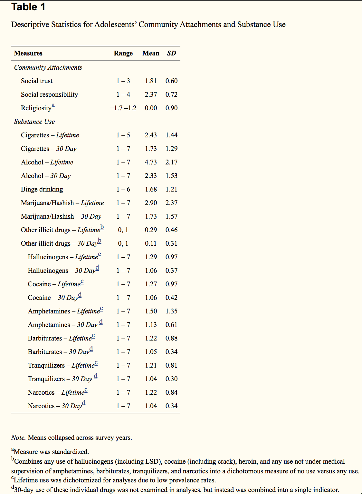

Notable differences: community attachments have stayed relatively similar (social responsibility went up a bit), but all types of substance use have gone down.

**2c. Compare to when we don't remove missing data? (later)**

```{r, echo=FALSE, eval=FALSE}
CreateTableOne(data = recoded)
```

--------
Prep for analysis:

<details>
<summary> Recoding variables to make it easy to use in SAS, and create different categories (click to see code) </summary>

```{r recodedForSAS, echo=FALSE, eval=TRUE}
# Create dummy variables for Race, College aspirations
# Recode sex and OtherIllicitDrugs (both types) as 1 or 0
# Recode parents edu as numerical (rather than factor levels)
# Create category levels for cigarettes, alcohol, binge drinking, and marijuana

forSAS = recoded_without_missing %>% 
  mutate(., SexMale = as.numeric(recode(Sex,
                                        'Male' = 1,
                                        'Female' = 0)),
         RaceWhite = as.numeric(case_when(
                                        Race == 'White' ~ 1,
                                        TRUE ~ 0)),
         RaceBlack = as.numeric(case_when(
                                        Race == 'Black' ~ 1,
                                        TRUE ~ 0)),
         No_college_plans = as.numeric(case_when(
                                        College_aspirations == 'No college plans' ~ 1,
                                        TRUE ~ 0)),
         Two_year_college = as.numeric(case_when(
                                        College_aspirations == '2-year college plans' ~ 1,
                                        TRUE ~ 0)),
         Other_illicit_drugs_Lifetime = as.numeric(recode(Other_illicit_drugs_Lifetime,
                                        'Yes' = 1,
                                        'No' = 0)),
         Other_illicit_drugs_30Day = as.numeric(recode(Other_illicit_drugs_30Day,
                                        'Yes' = 1,
                                        'No' = 0)),
         Parents_education = as.numeric(Parents_education),
         Alcohol_Lifetime_cat = as.factor(case_when(
                                        Alcohol_Lifetime == 1 ~ 'No use',
                                        Alcohol_Lifetime == 2 | Alcohol_Lifetime == 3 ~ 'Occasional use',
                                        TRUE ~ 'Frequent use')),
         Alcohol_30Day_cat = as.factor(case_when(
                                        Alcohol_30Day == 1 ~ 'No use',
                                        Alcohol_30Day == 2 ~ 'Occasional use',
                                        TRUE ~ 'Frequent use')),
         Marijuana_Lifetime_cat = as.factor(case_when(
                                        Marijuana_Lifetime == 1 ~ 'No use',
                                        Marijuana_Lifetime == 2 | Marijuana_Lifetime == 3 ~ 'Occasional use',
                                        TRUE ~ 'Frequent use')),
         Marijuana_30Day_cat = as.factor(case_when(
                                        Marijuana_30Day == 1 ~ 'No use',
                                        Marijuana_30Day == 2 ~ 'Occasional use',
                                        TRUE ~ 'Frequent use')),
         Cigarettes_Lifetime_cat = as.factor(case_when(
                                        Cigarettes_Lifetime == 1 ~ 'No use',
                                        Cigarettes_Lifetime == 2 | Cigarettes_Lifetime == 3 ~ 'Occasional use',
                                        TRUE ~ 'Frequent use')),
         Cigarettes_30Day_cat = as.factor(case_when(
                                        Cigarettes_30Day == 1 ~ 'No use',
                                        Cigarettes_30Day == 2 ~ 'Occasional use',
                                        TRUE ~ 'Frequent use')),
         Binge_Drinking_cat = as.factor(case_when(
                                        Binge_Drinking == 1 ~ 'None',
                                        TRUE ~ 'Any'))
  )

#summary(forSAS)
```

</details>

I don't yet know how to do all of the analysis in R, so I'm going to export to CSV and do some of the analysis in SAS.

```{r export, echo=FALSE}
write.csv(recoded_without_missing, "RecodedDataWithoutMissing.csv")
write.csv(forSAS, "forSAS.csv")
```

-------

### Visualizing the trends over time

```{r prep_medium_years_for_visualization, include=FALSE}
## Our variables of interest for this graph
substance_use_small_set = c("#CIGS SMKD/30DAY",
                  "#X ALC/30D SIPS",
                  "#X DRNK/LAST30DAY",
                  "#XMJ+HS/LAST30DAY"
                  )

variables_to_include = c(substance_use_small_set, community_attachment)

## Getting the data
grade12_file1_mappingMED = tibble()
grade12_file2_mappingMED = tibble()

for (year in medium_years) {
  grade12_file1_mappingMED = rbind(grade12_file1_mappingMED,
                                create_mapping(path = "~/Documents/Code/MTF/MTFData/12th_grade/",
                                               year = year,
                                               file_number = 1
                                               )
                                )
    grade12_file2_mappingMED = rbind(grade12_file2_mappingMED,
                                create_mapping(path = "~/Documents/Code/MTF/MTFData/12th_grade/",
                                               year = year,
                                               file_number = 2
                                               )
                                )
}
```

``` {r, include=FALSE}
raw_data_file1MED = get_specific_data_by_years(path = "~/Documents/Code/MTF/MTFData/12th_grade/",
                                     file_number = 1,
                                     years = medium_years,
                                     mapping = grade12_file1_mappingMED,
                                     variables_to_include = c("R'S ID-SERIAL #", 
                                                              "SAMPLING WEIGHT",
                                                              substance_use_small_set)
                                     )

raw_data_file2MED = get_specific_data_by_years(path = "~/Documents/Code/MTF/MTFData/12th_grade/",
                                     file_number = 2,
                                     years = medium_years,
                                     mapping = grade12_file2_mappingMED,
                                     variables_to_include = c("R'S ID-SERIAL #",
                                                              community_attachment)
                                     )

raw_data_combinedMED = inner_join(raw_data_file1MED, raw_data_file2MED, by = c("R'S ID-SERIAL #", "year"))


## Data wrangling / cleanup
recodedMED = raw_data_combinedMED %>% 
  na_if(., -9) %>% # This is how MTF codes missing values
  na_if(., -8) %>% # This is how my code (and sometimes MTF) codes questions that weren't asked to a participant
  
  # Values we can use as-is without mutating:
  rename(.,
         `Cigarettes_30Day` = `#CIGS SMKD/30DAY`,
         `Marijuana_30Day` = `#XMJ+HS/LAST30DAY`,
         ) %>% 
  
  # Create social trust score and social responsibility score
  mutate(., `Social_Trust` = rowMeans(cbind(`PPL CAN B TRSTD`, `PPL TRY B HLPFL`, `PPL TRY BE FAIR`), na.rm = TRUE),
         `Social_Trust_NO_MISSING` = rowMeans(cbind(`PPL CAN B TRSTD`, `PPL TRY B HLPFL`, `PPL TRY BE FAIR`)),
         `Social_Responsibility` = rowMeans(cbind(`IMP CNTRBTN SOC`, `IMP CRRCT INEQL`, `IMP LDR COMUNTY`), na.rm = TRUE),
         `Social_Responsibility_NO_MISSING` = rowMeans(cbind(`IMP CNTRBTN SOC`, `IMP CRRCT INEQL`, `IMP LDR COMUNTY`))
         ) %>% 
  
  # Prep work and then create religiosity score
  mutate(., rel1scaled = scale(`R'ATTND REL SVC`),
         rel2scaled = scale(`RLGN IMP R'S LF`),
         `Religiosity` = rowMeans(cbind(rel1scaled, rel2scaled), na.rm = TRUE),
         `Religiosity_NO_MISSING` = rowMeans(cbind(rel1scaled, rel2scaled))
         ) %>% 
  
  # Substance use questions - renamed and recoded
  mutate(.,
         `Alcohol_30Day` = case_when(
           year >= 1994 ~ `#X ALC/30D SIPS`,
           year < 1994 ~ `#X DRNK/LAST30DAY`)
         ) %>% 
  select(.,
         year,
         Alcohol_30Day,
         Cigarettes_30Day,
         Marijuana_30Day,
         Social_Trust,
         Social_Responsibility,
         Religiosity,
         `SAMPLING WEIGHT`
         )

recoded_without_missingMED = na.omit(recodedMED)
```

``` {r, include=FALSE}
forSASsmall = forSAS %>% 
  select(.,
         year,
         Alcohol_30Day,
         Cigarettes_30Day,
         Marijuana_30Day,
         Social_Trust,
         Social_Responsibility,
         Religiosity,
         `SAMPLING WEIGHT`
         )

combined_years = bind_rows(recodedMED, forSASsmall)

# AFTER THAT: make two graphs, mapping mean community attachment scores.

```

```{r graphs, include=FALSE}
to_graph = tibble(year = c(1990:2019))

for (variable in c('Alcohol_30Day',
              'Cigarettes_30Day',
              'Marijuana_30Day'
              #Social_Trust,
              #Social_Responsibility,
              #Religiosity
              )) {
    
  counts = combined_years %>% 
    mutate(.,
           matches_criteria = 
             case_when(!!sym(variable) %in% 2:7 ~ "yes",
                       !!sym(variable) == 1 ~ "no",
                       TRUE ~ "leave out")
    ) %>% 
    group_by(., year) %>% 
    count(., matches_criteria, wt = `SAMPLING WEIGHT`)
  
  percent_yes_db = counts %>%
    pivot_wider(., names_from = matches_criteria, values_from = n) %>%
    mutate(.,
           !!as.name(variable) := (yes / (yes + no))*100
    ) %>%
    select(., year, !!as.name(variable)) %>%
    ungroup(.)
  
  to_graph = inner_join(to_graph, percent_yes_db, by = 'year')
}

for (variable in c(
              "Social_Trust",
              "Social_Responsibility",
              "Religiosity"
              )) {
    
  counts = combined_years %>% 
    group_by(., year) %>% 
    summarize(., !!as.name(variable) := mean(!!sym(variable), wt = `SAMPLING WEIGHT`, na.rm = TRUE))
  
  to_graph = inner_join(to_graph, counts, by = 'year')
}
```

```{r, include=FALSE}
to_graph = pivot_longer(to_graph, cols = c(Alcohol_30Day,
                                           Cigarettes_30Day,
                                           Marijuana_30Day),
                        names_to = "Substance",
                        values_to = "percent")

to_graph = pivot_longer(to_graph, cols = c(Social_Trust,
                                           Social_Responsibility
                                           #Religiosity
                                           ),
                        names_to = "Community Attachment",
                        values_to = "Mean Score")

```

```{r, echo=FALSE}
plot = ggplot(to_graph, aes(x = year, y = percent, color = Substance)) +
  geom_line() + geom_vline(xintercept=2009, linetype="dashed", color = "red") +

  labs(
    title = "Percent of 12th graders reporting any substance use in the past 30 days",
    x = "Year",
    y = "Prevalence"
  )  + theme(plot.title = element_text(size = 13, face = "bold"))
  #+ scale_x_continuous(breaks = seq(1990, 2018, 2))
plot

plot2 = ggplot(to_graph, aes(x = year, y = `Mean Score`, color = `Community Attachment`)) +
  geom_line() + scale_color_brewer(palette="Dark2") + geom_vline(xintercept=2009, linetype="dashed", color = "red") +

  labs(
    title = "Mean yearly score for each social trust and responsibility",
    x = "Year",
    y = "Mean Score"
  ) + theme(plot.title = element_text(size = 13, face = "bold"))
  #+ scale_x_continuous(breaks = seq(1990, 2018, 2))
plot2

```


### Step 4: Build regression models

But first, here's a look at the correlations from the original paper and from my more recent data:

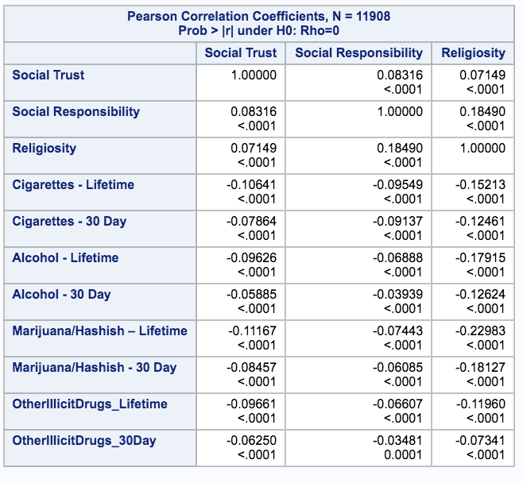
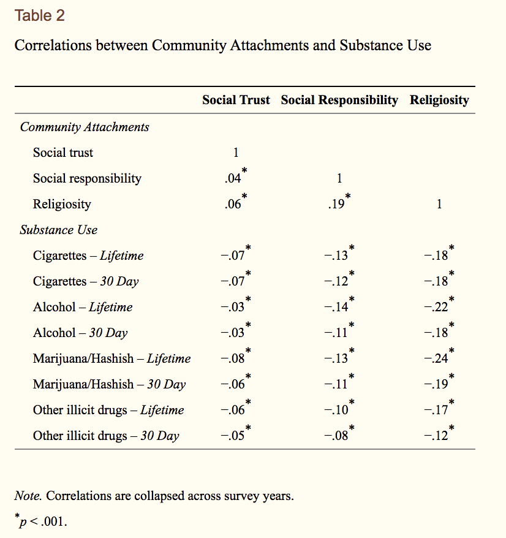
*Question: Should I be running these correlations against the raw data, or against the new variables that I created by dichotomozing/categorizing the outcomes in different ways? Here, I've done the "raw" data*

**Overall observation** Across each outcome, the correlations with social trust are a little higher, and the correlations with social responsibility and religiosity are both a little lower.

#### Check assumptions

0. Plot the shape of outcome variables and main predictors (just to see how they seem).

<details>
<summary>Show plots (done in SAS)</summary>

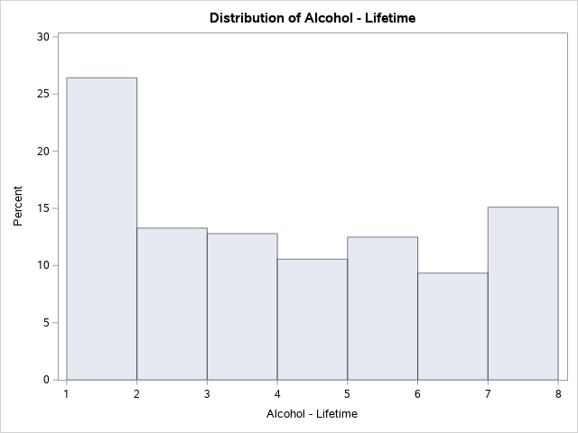
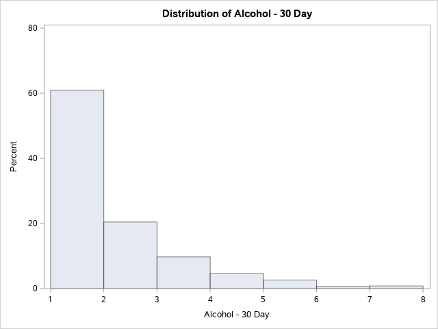
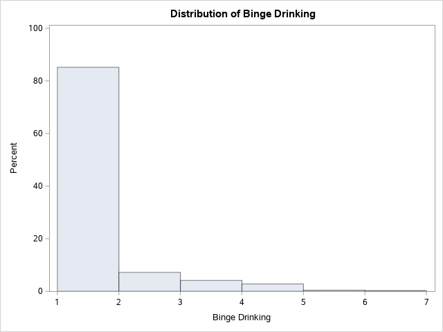
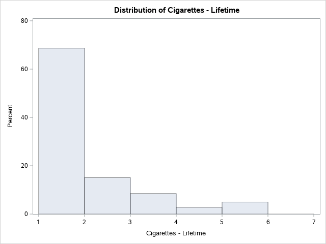
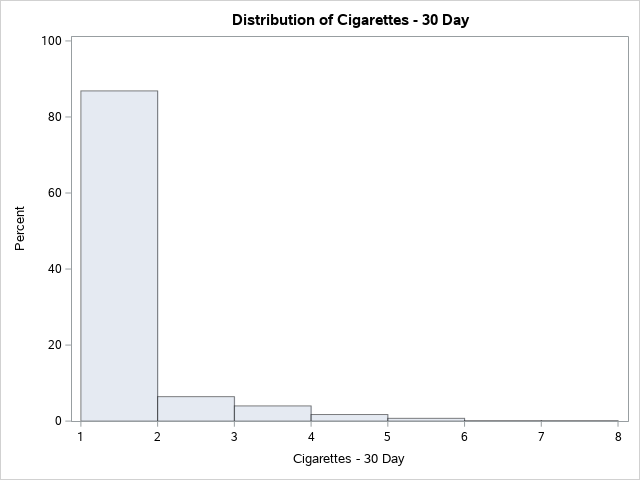
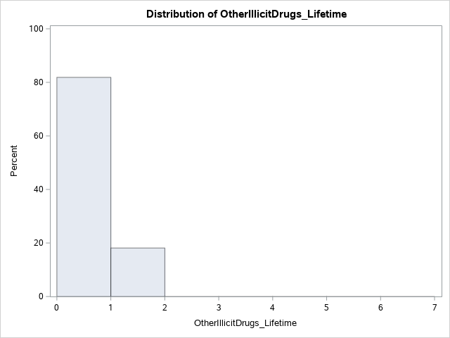
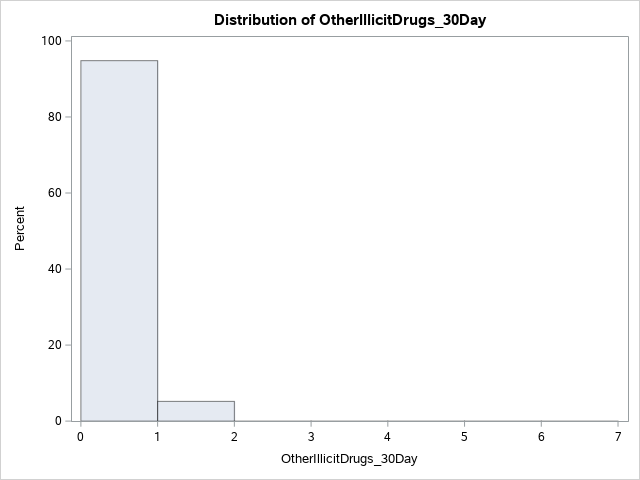

</details>
</br>

1. **Check for unusual/influential data** - create and check plots for datapoints where leverage + Rstudent are too big
2. **Normality (of residuals)** - plot histogram of residuals, look at the plot, do Kolmogorov-Smirnov test
3. **Heteroscedasticity (of residuals)** - plot residuals vs. regression line (can you do that with multivariable regression? what are the axes?), look at the plots, do White test
4. **Multicolinearity** - create a table and look at Tolerance/VIF (rough cutoff: VIF > 10)
5. **Independence** - brainstorm what might make observations not-independent (ex. ID, year, region, ??). plot outcome vs. those variables, look for trends. What to do if we don't have independence??
6. **Nonlinearity** - ??? (how to plot this with multivariable regression?)

Note: These things might change as I add in new variables, or analyze different sets of years, so this isn't just a one-and-done process. One thing I immediately notice is that in the original paper, marijuana, cigarettes, and alcohol use were all coded as continuous and used as the outcomes for linear regression, even though some are heavily right-skewed, and the categories aren't even necessarily ordered. "Other illicit drugs" is a binary outcome for logistic regression.
*--> I've decided to recode (above) to make all outcomes unordered categorical or binary variables*

I don't know how to check all of the assumptions above, but it's a good roadmap for if I were going to do this analysis more rigorously.

#### Regression models

1. Make regression models for 9 outcomes from the original paper

<details>
<summary> Regression output </summary>
```{r logit, echo=FALSE}
## NOTE 1: I'd love for this to be a function where I pass in different outcome values, but I can't figure out how, since I'm not sure if I'm supposed to be passing in a string, a symbol, etc. So for now it's just a lot of copy-pasting :(

## NOTE 2: I'm not sure how to do polytomous regression in R, so I'm pasting in those outputs from SAS

# cat("\n\nCigarettes - Lifetime\n")
# logit1 <- glm(Cigarettes_Lifetime ~ 
#               Social_Trust + Social_Responsibility + Religiosity + 
# 		          SexMale + RaceWhite + RaceBlack + High_school_grades + 
# 		          No_college_plans + Two_year_college + Parents_education,
#               data = forSAS,
# 		          family = "binomial")
# summary(logit1)
# exp(cbind(OR = coef(logit1), confint(logit1)))
# 
# cat("\n\nCigarettes - 30 Day\n")
# logit2 <- glm(Cigarettes_30Day ~ 
#               Social_Trust + Social_Responsibility + Religiosity + 
# 		          SexMale + RaceWhite + RaceBlack + High_school_grades + 
# 		          No_college_plans + Two_year_college + Parents_education,
#               data = forSAS,
# 		          family = "binomial")
# summary(logit2)
# exp(cbind(OR = coef(logit2), confint(logit2)))
# 
# cat("\n\nAlcohol - Lifetime\n")
# logit3 <- glm(Alcohol_Lifetime ~ 
#               Social_Trust + Social_Responsibility + Religiosity + 
# 		          SexMale + RaceWhite + RaceBlack + High_school_grades + 
# 		          No_college_plans + Two_year_college + Parents_education,
#               data = forSAS,
# 		          family = "binomial")
# summary(logit3)
# exp(cbind(OR = coef(logit3), confint(logit3)))
# 
# cat("\n\nAlcohol - 30 Day\n")
# logit4 <- glm(Alcohol_30Day ~ 
#               Social_Trust + Social_Responsibility + Religiosity + 
# 		          SexMale + RaceWhite + RaceBlack + High_school_grades + 
# 		          No_college_plans + Two_year_college + Parents_education,
#               data = forSAS,
# 		          family = "binomial")
# summary(logit4)
# exp(cbind(OR = coef(logit4), confint(logit4)))

cat("\n\nBinge Drinking\n")
logit5 <- glm(as.factor(recode(Binge_Drinking, 'None' = 0, 'Any' = 1)) ~ 
              Social_Trust + Social_Responsibility + Religiosity + 
		          SexMale + RaceWhite + RaceBlack + High_school_grades + 
		          No_college_plans + Two_year_college + Parents_education,
              data = forSAS,
		          family = "binomial")
summary(logit5)
exp(cbind(OR = coef(logit5), confint(logit5)))

# cat("\n\nMarijuana - Lifetime\n")
# logit6 <- glm(Marijuana_Lifetime ~ 
#               Social_Trust + Social_Responsibility + Religiosity + 
# 		          SexMale + RaceWhite + RaceBlack + High_school_grades + 
# 		          No_college_plans + Two_year_college + Parents_education,
#               data = forSAS,
# 		          family = "binomial")
# summary(logit6)
# exp(cbind(OR = coef(logit6), confint(logit6)))
# 
# cat("\n\nMarijuana - 30 Day\n")
# logit7 <- glm(Marijuana_30Day ~ 
#               Social_Trust + Social_Responsibility + Religiosity + 
# 		          SexMale + RaceWhite + RaceBlack + High_school_grades + 
# 		          No_college_plans + Two_year_college + Parents_education,
#               data = forSAS,
# 		          family = "binomial")
# summary(logit7)
# exp(cbind(OR = coef(logit7), confint(logit7)))

cat("\n\nOther Illicit Drugs - Lifetime\n")
logit8 <- glm(Other_illicit_drugs_Lifetime ~ 
              Social_Trust + Social_Responsibility + Religiosity + 
		          SexMale + RaceWhite + RaceBlack + High_school_grades + 
		          No_college_plans + Two_year_college + Parents_education,
              data = forSAS,
		          family = "binomial")
summary(logit8)
exp(cbind(OR = coef(logit8), confint(logit8)))

cat("\n\nOther Illicit Drugs - 30 Day\n")
logit9 <- glm(Other_illicit_drugs_30Day ~ 
              Social_Trust + Social_Responsibility + Religiosity + 
		          SexMale + RaceWhite + RaceBlack + High_school_grades + 
		          No_college_plans + Two_year_college + Parents_education,
              data = forSAS,
		          family = "binomial")
summary(logit9)
exp(cbind(OR = coef(logit9), confint(logit9)))

```

From SAS:
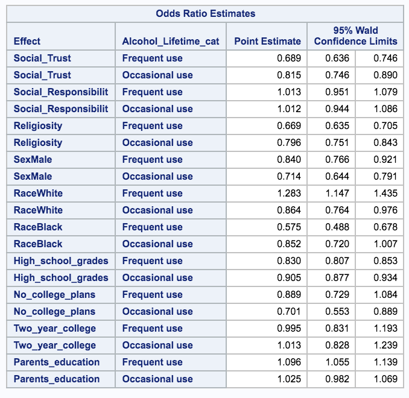
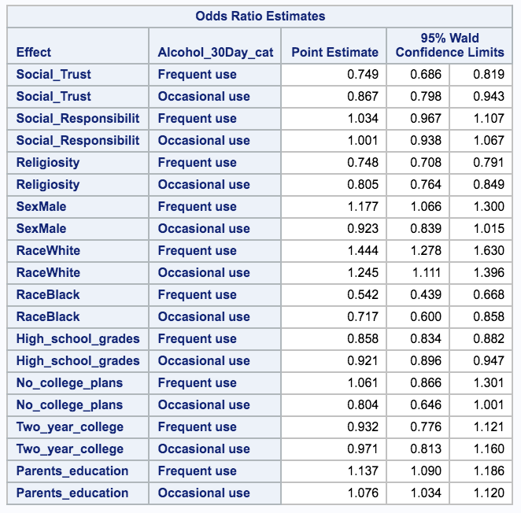
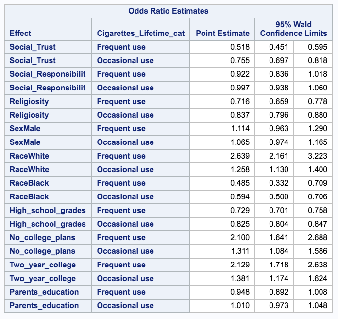
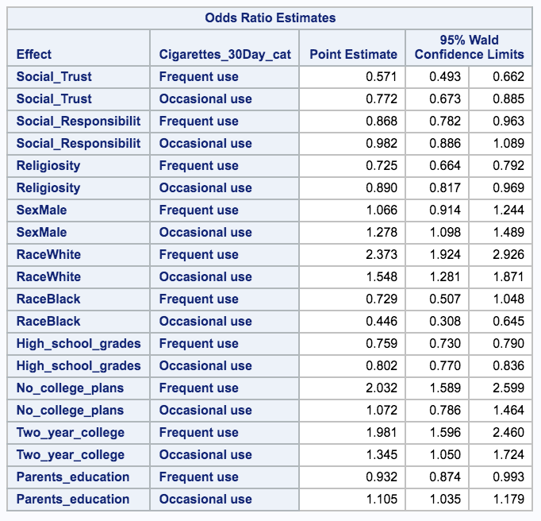
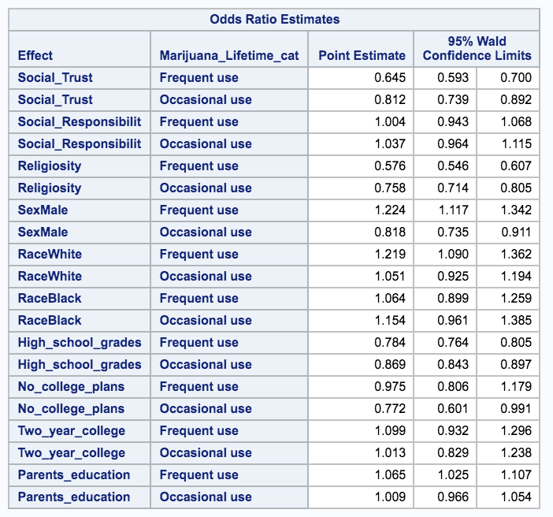
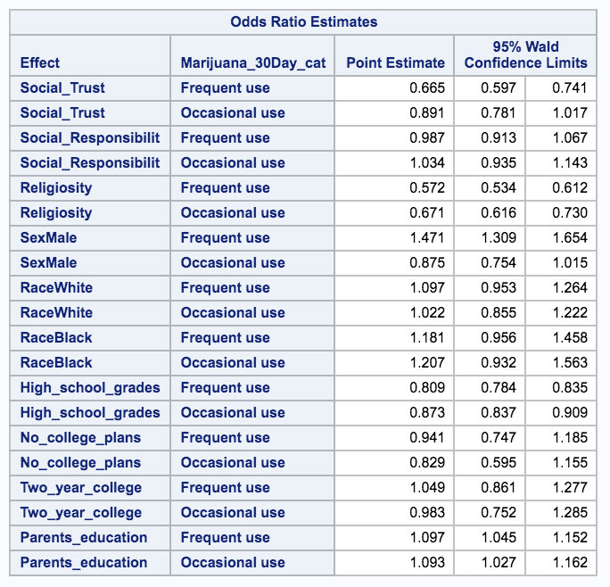

</details>

**Main results**


2. Compare with previous results

<details>
<summary> Click here to see the regression models from the original paper</summary>

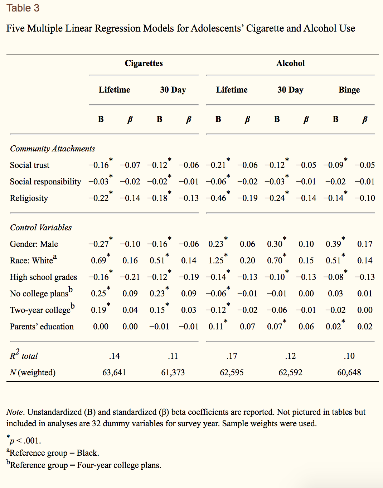
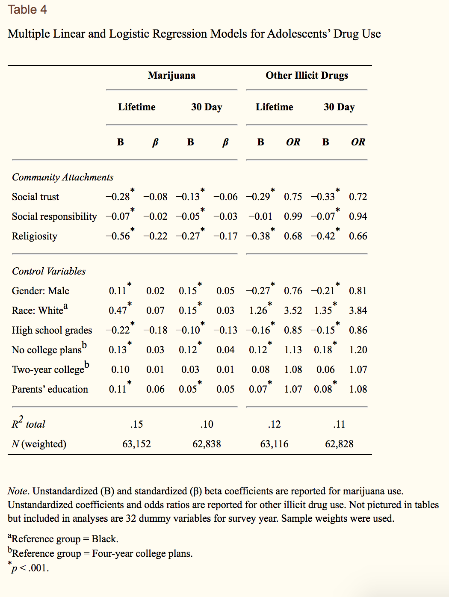

</details>

**Relevant comparissons**

# Random questions and notes for later:

**About the findings/context:**

1. Is religiosity driving the whole community attachment indicator?

**About the data & R:**

1.  Somewhere, data from before 1990 is formatted differently (the names of the columns), so I need to incorporate that into my code if I want to recreate the analysis from the original years, rather than just update it for recent years
2. Do I need to code things as dummy variables, or does R have a way to do regression without?
--> Related: should everything be factors?
3. When averaging things (like for social trust score) is it ok if you're missing one of the 3 things to average?
--> Answer: this might be a good candidate for imputation (and all the other missing data as well)