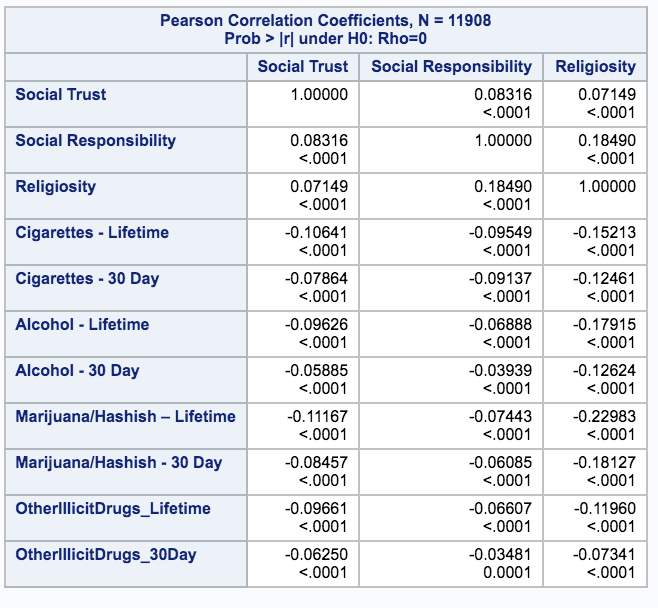
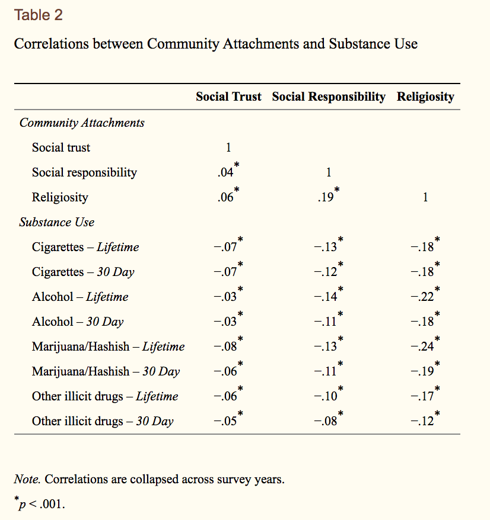
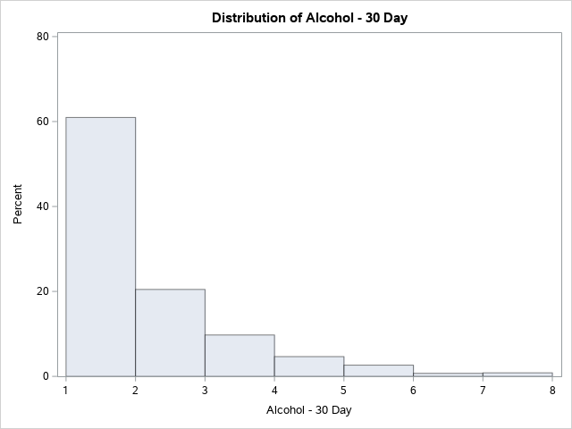
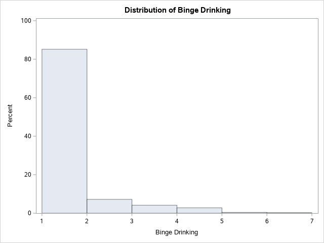
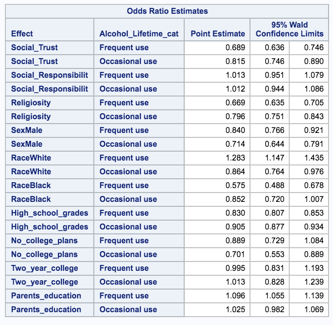
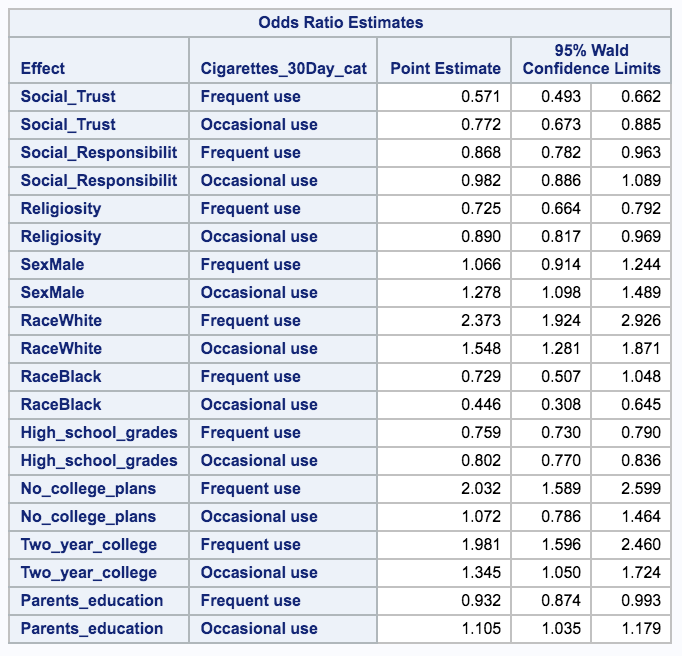
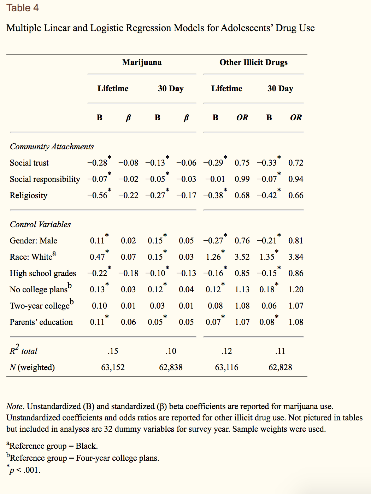

Community Attachment
================

Using the paper [Associations between Community Attachments and
Adolescent Substance Use in Nationally Representative
Samples](https://www.ncbi.nlm.nih.gov/pmc/articles/PMC3699306/) as a
reference, I’m trying to replicate the original results (1976-2008), and
then see how community attachment relates to substance use in the period
from 2009-2018.

Some random thoughts and new directions I have in mind for potential
next steps:

  - What’s different about 2009-2018?
      - Legalization of marijuana
      - Opioid crisis
      - Financial crisis
      - Drug use in general going down, but marijuana staying constant
  - Other exposures/predictors to look at:
      - Broader “society attachment” / faith in institutions (ex. “do
        you think voting matters?”)
      - Community/society engagement (not just attachment) - things like
        having a job, drivers license, community service
      - Deeper dive into gender differences?
  - Another outcome: Mental health (internalizing/externalizing)?

# Code setup

## Step 0. Import helper functions, define constants, etc.

Luckily, everything in the base set of community attachment measures,
substance use, and most control variables are asked in form 1 (file 2).
I’ll also need to pull some basic demographics from the core form (file
1).

<details>

<summary> Click to see code & notes </summary>

``` r
all_years = 1976:2018
old_years = 1976:2008
medium_years = 1990:2008
new_years = 2009:2018
```

These two helper functions come from separate R scripts.

Create a standardized list of names for variables across years.

TODO - this shouldn’t happen in this file…. once I’ve gotten a better
handle on it I’d like to do this somewhere separate and have a
definitive static file of standard names to reference.

``` r
grade12_file1_mapping = tibble()
grade12_file2_mapping = tibble()

for (year in new_years) {
  grade12_file1_mapping = rbind(grade12_file1_mapping,
                                create_mapping(path = "~/Documents/Code/MTF/MTFData/12th_grade/",
                                               year = year,
                                               file_number = 1
                                               )
                                )
    grade12_file2_mapping = rbind(grade12_file2_mapping,
                                create_mapping(path = "~/Documents/Code/MTF/MTFData/12th_grade/",
                                               year = year,
                                               file_number = 2
                                               )
                                )
}
```

</details>

## Step 1: Create a smaller database that includes only the variables I need

**First, define the list of variables we want.** The original paper
includes demographics (control variables), measures of community
attachment, and substance use.

<details>

<summary> Click to see code & notes </summary>

``` r
demographics = c("R'S ID-SERIAL #",
                 "SAMPLING WEIGHT",
                 "R'S SEX",
                 "R'S RACE", # Only for years before 2005
                 "R'S RACE B/W/H",
                 "FATHR EDUC LEVEL",
                 "MOTHR EDUC LEVEL",
                 "R WL DO 2YR CLG",
                 "R WL DO 4YR CLG",
                 "R HS GRADE/D=1"
                 )

social_trust = c("PPL TRY BE FAIR",
                 "PPL TRY B HLPFL",
                 "PPL CAN B TRSTD"
                 )

social_responsibility = c("IMP CNTRBTN SOC",
                          "IMP LDR COMUNTY",
                          "IMP CRRCT INEQL"
                          )

religiosity = c("R'ATTND REL SVC",
                "RLGN IMP R'S LF")

community_attachment = c(social_trust,
                         social_responsibility,
                         religiosity
                         )

substance_use = c("EVR SMK CIG,REGL",
                  "#CIGS SMKD/30DAY",
                  "#X ALC/LIF SIPS",
                  "#X DRNK/LIFETIME",
                  "#X ALC/30D SIPS",
                  "#X DRNK/LAST30DAY",
                  "5+DRK ROW/LST 2W",
                  "#XMJ+HS/LIFETIME",
                  "#XMJ+HS/LAST30DAY",
                  "#X LSD/LIFETIME",
                  "#X LSD/LAST30DAY",
                  "#X PSYD/LIFETIME",
                  "#X PSYD/LAST30DAY",
                  "#X COKE/LIFETIME",
                  "#X COKE/LAST30DAY",
                  "#X AMPH/LIFETIME",
                  "#X AMPH/LAST30DAY",
                  "#X SED/BARB/LAST30DAY",
                  "#X SED/BARB/LIFETIME",
                  "#X TRQL/LIFETIME",
                  "#X TRQL/LAST30DAY",
                  "#X NARC/LIFETIME",
                  "#X NARC/LAST30DAY"
                  )

# Notes about how to find stuff in the data:
# Lifetime alcohol & 30-day alcohol --
#    `#X ALC/LIF SIPS` and `#X ALC/30D SIPS` are only in 2009-2016
#    `#X DRNK/LIFETIME` and `#X DRNK/LAST30DAY` are how it's labeled in 2017-18
#    **** TODO **** (make sure it's the same coding, then combine into one helpful name)
# Other illicit drugs -- 
#    hallucinogens: include LSD & hall. other than LSD -- include MDMA? (I think no)
```

I’m potentially interested in a handful more variables, such as *X, Y, Z
(not added in
yet\!)*.

``` r
# TODO - fill in later. Make sure the variables are from the same forms or can somehow be compared against what we're already searching for...
```

</details>

<br> **Next, get data from all participants for each of the variables
above. Merge/combine by ID number and year.**

<details>

<summary> Click to see code & notes </summary> Notes:

TODO: probably worth making/modifying a helper function so that the
merges can be automatic.

Although many of the variables in can be found in file 1 and file 2, the
variables names are cleaner for substance use in file 1, so I’ve decided
to get all deomgraphics and substance use info from file 1, all
community attachment info from file 2, and combine on ID number.

``` r
# TODO: add in from new_variable_lists once I get there
# TODO: switch from new_years to all_years once I've gotten the old data into good shape

raw_data_file1 = get_specific_data_by_years(path = "~/Documents/Code/MTF/MTFData/12th_grade/",
                                     file_number = 1,
                                     years = new_years,
                                     mapping = grade12_file1_mapping,
                                     variables_to_include = c(demographics,
                                                              substance_use)
                                     )

raw_data_file2 = get_specific_data_by_years(path = "~/Documents/Code/MTF/MTFData/12th_grade/",
                                     file_number = 2,
                                     years = new_years,
                                     mapping = grade12_file2_mapping,
                                     variables_to_include = c("R'S ID-SERIAL #",
                                                              community_attachment)
                                     )
```

``` r
raw_data_combined = inner_join(raw_data_file1, raw_data_file2, by = c("R'S ID-SERIAL #", "year"))

knitr::kable(raw_data_combined[100:105,])
```

| \#CIGS SMKD/30DAY | \#X ALC/30D SIPS | \#X ALC/LIF SIPS | \#X AMPH/LAST30DAY | \#X AMPH/LIFETIME | \#X COKE/LAST30DAY | \#X COKE/LIFETIME | \#X DRNK/LAST30DAY | \#X DRNK/LIFETIME | \#X LSD/LAST30DAY | \#X LSD/LIFETIME | \#X NARC/LAST30DAY | \#X NARC/LIFETIME | \#X PSYD/LAST30DAY | \#X PSYD/LIFETIME | \#X SED/BARB/LAST30DAY | \#X SED/BARB/LIFETIME | \#X TRQL/LAST30DAY | \#X TRQL/LIFETIME | \#XMJ+HS/LAST30DAY | \#XMJ+HS/LIFETIME | 5+DRK ROW/LST 2W | EVR SMK CIG,REGL | FATHR EDUC LEVEL | grade.x | MOTHR EDUC LEVEL | R HS GRADE/D=1 | R WL DO 2YR CLG | R WL DO 4YR CLG | R’S ID-SERIAL \# | R’S RACE | R’S RACE B/W/H | R’S SEX | SAMPLING WEIGHT | year | grade.y | IMP CNTRBTN SOC | IMP CRRCT INEQL | IMP LDR COMUNTY | PPL CAN B TRSTD | PPL TRY B HLPFL | PPL TRY BE FAIR | R’ATTND REL SVC | RLGN IMP R’S LF |
| ----------------: | ---------------: | ---------------: | -----------------: | ----------------: | -----------------: | ----------------: | -----------------: | ----------------: | ----------------: | ---------------: | -----------------: | ----------------: | -----------------: | ----------------: | ---------------------: | --------------------: | -----------------: | ----------------: | -----------------: | ----------------: | ---------------: | ---------------: | ---------------: | ------: | ---------------: | -------------: | --------------: | --------------: | ---------------: | -------: | -------------: | ------: | --------------: | ---: | ------: | --------------: | --------------: | --------------: | --------------: | --------------: | --------------: | --------------: | --------------: |
|                 1 |                1 |                5 |                  1 |                 1 |                  1 |                 1 |                \-8 |               \-8 |                 1 |                1 |                  1 |                 1 |                  1 |                 1 |                      1 |                     1 |                  1 |                 1 |                  1 |                 1 |                1 |                1 |                7 |      12 |                1 |              4 |               1 |               3 |            10100 |      \-8 |              3 |       1 |          1.4732 | 2009 |      12 |               3 |               2 |               2 |               1 |               1 |               1 |             \-9 |             \-9 |
|                 4 |                3 |                7 |                  1 |                 1 |                  1 |                 1 |                \-8 |               \-8 |                 1 |                1 |                  1 |                 1 |                  1 |                 1 |                      1 |                     1 |                  1 |                 1 |                  1 |                 1 |                2 |                5 |                3 |      12 |                3 |              2 |               3 |               3 |            10101 |      \-8 |              2 |       1 |          1.3784 | 2009 |      12 |               2 |               2 |               3 |               2 |               1 |               1 |               4 |               3 |
|                 1 |                1 |                3 |                  1 |                 1 |                  1 |                 1 |                \-8 |               \-8 |                 1 |                1 |                  1 |                 2 |                  1 |                 1 |                      1 |                     1 |                  1 |                 1 |                  1 |                 1 |                1 |                1 |                2 |      12 |                4 |              6 |               3 |               3 |            10102 |      \-8 |              2 |       2 |          2.5084 | 2009 |      12 |               3 |               3 |               2 |               1 |               2 |               2 |               2 |               3 |
|                 4 |                2 |                7 |                  1 |                 1 |                  1 |                 1 |                \-8 |               \-8 |                 1 |                1 |                  1 |                 1 |                  1 |                 2 |                      1 |                     1 |                  1 |                 1 |                  4 |                 7 |                2 |                5 |                3 |      12 |                4 |              6 |               1 |               3 |            10103 |      \-8 |              2 |       2 |          0.3013 | 2009 |      12 |               3 |               4 |               4 |               1 |               2 |               1 |             \-9 |             \-9 |
|                 1 |                1 |                1 |                \-9 |               \-9 |                  1 |                 1 |                \-8 |               \-8 |                 1 |                1 |                  1 |                 1 |                  1 |                 1 |                      1 |                     1 |                  1 |                 1 |                  1 |                 1 |                1 |                1 |                3 |      12 |                3 |              4 |               3 |               2 |            10104 |      \-8 |            \-9 |       2 |          1.4105 | 2009 |      12 |               3 |               3 |               2 |               1 |               2 |               1 |               4 |               4 |
|                 1 |                2 |                4 |                  1 |                 1 |                  1 |                 1 |                \-8 |               \-8 |                 1 |                1 |                  1 |                 3 |                  1 |                 1 |                      1 |                     1 |                  1 |                 1 |                  1 |                 2 |                2 |                2 |                3 |      12 |                3 |              9 |               2 |               4 |            10105 |      \-8 |              2 |       2 |          1.0390 | 2009 |      12 |               2 |               1 |               2 |               1 |               1 |               2 |               2 |               2 |

``` r
#summary(raw_data_combined)
```

</details>

## Step 2: Recode, create indicators/aggregate values, etc.

What I’ve done so far:

1.  Create social trust score
2.  Create social responsibility score
3.  Create religiosity score
4.  Combine substance use levels where appropriate (to make `other
    illicit drugs` category)
5.  Combine momEd and dadEd into SES
6.  Combine 2yr and 4yr college graduation expectations
7.  Recode all `-9` as `NA` to take advantage of R’s built-in handling
    of missing data

Haven’t done yet:

8.  Create dummy variable for each year of the survey, to account for
    historical trends. (Note: in original paper they did this and then
    found the dummy variables to not be significant. But it’s worth it
    for me to check, both for 2009-2018 and if I add in any new
    predictors or outcoems.)
9.  Dealt with missing data -\> Impute? Throw out any participants who
    have any missing data?
10. Make a definitive decision on how to handle the `race` variable
    *NOTE - look to example from lab code\!*

<details>

<summary>Click to see the data wrangling
code</summary>

``` r
# TODO - remove 'NO_MISSING' versions of community attachment scores if I decide that's the right approach (currently not selected)

recoded = raw_data_combined %>% 
  na_if(., -9) %>% # This is how MTF codes missing values
  na_if(., -8) %>% # This is how my code (and sometimes MTF) codes questions that weren't asked to a participant
  
  # Values we can use as-is without mutating:
  rename(., `High_school_grades` = `R HS GRADE/D=1`,
         `Cigarettes_Lifetime` = `EVR SMK CIG,REGL`,
         `Cigarettes_30Day` = `#CIGS SMKD/30DAY`,
         `Binge_Drinking` = `5+DRK ROW/LST 2W`,
         `Marijuana_Lifetime` = `#XMJ+HS/LIFETIME`,
         `Marijuana_30Day` = `#XMJ+HS/LAST30DAY`,
         `Cocaine_Lifetime` = `#X COKE/LIFETIME`,
         `Cocaine_30Day` = `#X COKE/LAST30DAY`,
         `Amphetamines_Lifetime` = `#X AMPH/LIFETIME`,
         `Amphetamines_30Day` = `#X AMPH/LAST30DAY`,
         `Barbiturates_Lifetime` = `#X SED/BARB/LIFETIME`,
         `Barbiturates_30Day` = `#X SED/BARB/LAST30DAY`,
         `Tranquilizers_Lifetime` = `#X TRQL/LIFETIME`,
         `Tranquilizers_30Day` = `#X TRQL/LAST30DAY`,
         `Narcotics_Lifetime` = `#X NARC/LIFETIME`,
         `Narcotics_30Day` = `#X NARC/LAST30DAY`
         ) %>% 
  
  # For both of these, 7 meant "I don't know / doesn't apply" so I'm recoding those as missing
  mutate(., `MOTHR EDUC LEVEL` = na_if(`MOTHR EDUC LEVEL`, 7),
         `FATHR EDUC LEVEL` = na_if(`FATHR EDUC LEVEL`, 7)
         ) %>% 
  
  # Recode and rename demographics/control variables
  mutate(., Sex = as.factor(recode(`R'S SEX`,
                                   `1` = 'Male',
                                   `2` = 'Female')), # Male=1 Female=0
         Race = as.factor(recode(`R'S RACE B/W/H`,
                                 `1` = 'Black',
                                 `2` = 'White',
                                 `3` = 'Hispanic',
                                 .missing = 'Other/missing')), # White=1, Black=0, others=missing
         `College_aspirations` = as.factor(case_when(
           `R WL DO 4YR CLG` %in% c(3, 4) ~ '4-year college plans',
           `R WL DO 2YR CLG` %in% c(3, 4) ~ '2-year college plans',
           `R WL DO 2YR CLG` %in% c(1, 2) ~ 'No college plans')), # coded with dummy variables
         `Parents_education` = 
           as.factor(pmax(`MOTHR EDUC LEVEL`, `FATHR EDUC LEVEL`, na.rm = TRUE)) #NOTE - pmax does max comparissons element-by-element. if either value exists, return that instead of NA
         ) %>% 
  
  # Create social trust score and social responsibility score
  mutate(., `Social_Trust` = rowMeans(cbind(`PPL CAN B TRSTD`, `PPL TRY B HLPFL`, `PPL TRY BE FAIR`), na.rm = TRUE),
         `Social_Trust_NO_MISSING` = rowMeans(cbind(`PPL CAN B TRSTD`, `PPL TRY B HLPFL`, `PPL TRY BE FAIR`)),
         `Social_Responsibility` = rowMeans(cbind(`IMP CNTRBTN SOC`, `IMP CRRCT INEQL`, `IMP LDR COMUNTY`), na.rm = TRUE),
         `Social_Responsibility_NO_MISSING` = rowMeans(cbind(`IMP CNTRBTN SOC`, `IMP CRRCT INEQL`, `IMP LDR COMUNTY`))
         ) %>% 
  
  # Prep work and then create religiosity score
  mutate(., rel1scaled = scale(`R'ATTND REL SVC`),
         rel2scaled = scale(`RLGN IMP R'S LF`),
         `Religiosity` = rowMeans(cbind(rel1scaled, rel2scaled), na.rm = TRUE),
         `Religiosity_NO_MISSING` = rowMeans(cbind(rel1scaled, rel2scaled))
         ) %>% 
  
  # Substance use questions - renamed and recoded
  mutate(.,
         `Hallucinogens_Lifetime` = pmax(`#X LSD/LIFETIME`, `#X PSYD/LIFETIME`, na.rm = TRUE), # Double check these are correct
         `Hallucinogens_30Day` = pmax(`#X LSD/LAST30DAY`, `#X PSYD/LAST30DAY`, na.rm = TRUE),
         `Alcohol_Lifetime` = case_when(
           year <= 2016 ~ `#X ALC/LIF SIPS`,
           year > 2016 ~ `#X DRNK/LIFETIME`),
         `Alcohol_30Day` = case_when(
           year <= 2016 ~ `#X ALC/30D SIPS`,
           year > 2016 ~ `#X DRNK/LAST30DAY`),
         `Other_illicit_drugs_Lifetime` = as.factor(case_when(
           `Hallucinogens_Lifetime` > 1 | `Cocaine_Lifetime` > 1 |
            `Amphetamines_Lifetime` > 1 | `Barbiturates_Lifetime` > 1 |
            `Tranquilizers_Lifetime` > 1 | `Narcotics_Lifetime` > 1 ~ "Yes", # If their answer was greater than "none" for any illicit drug, code this as "yes"
           TRUE ~ "No")), # Otherwise, code as "No" --> could instead be 1/0
         `Other_illicit_drugs_30Day` = as.factor(case_when(
           `Hallucinogens_30Day` > 1 | `Cocaine_30Day` > 1 |
            `Amphetamines_30Day` > 1 | `Barbiturates_30Day` > 1 |
            `Tranquilizers_30Day` > 1 | `Narcotics_30Day` > 1 ~ "Yes",
           TRUE ~ "No"))
         ) %>% 
  
  # Rearrange columns, and get rid of any we don't need any more
  select(., `R'S ID-SERIAL #`, `SAMPLING WEIGHT`,
         year, Sex, Race, `High_school_grades`, `College_aspirations`, `Parents_education`,
         `Social_Trust`, `Social_Responsibility`, `Religiosity`,
         `Cigarettes_Lifetime`,
         `Cigarettes_30Day`,
         `Alcohol_Lifetime`,
         `Alcohol_30Day`,
         `Binge_Drinking`,
         `Marijuana_Lifetime`,
         `Marijuana_30Day`,
         `Other_illicit_drugs_Lifetime`,
         `Other_illicit_drugs_30Day`,
         `Hallucinogens_Lifetime`,
         `Hallucinogens_30Day`,
         `Cocaine_Lifetime`,
         `Cocaine_30Day`,
         `Amphetamines_Lifetime`,
         `Amphetamines_30Day`,
         `Barbiturates_Lifetime`,
         `Barbiturates_30Day`,
         `Tranquilizers_Lifetime`,
         `Tranquilizers_30Day`,
         `Narcotics_Lifetime`,
         `Narcotics_30Day`,
         )
```

</details>

<br> Here’s a snapshot of what the data looks like at this
point:

| R’S ID-SERIAL \# | SAMPLING WEIGHT | year | Sex    | Race          | High\_school\_grades | College\_aspirations | Parents\_education | Social\_Trust | Social\_Responsibility | Religiosity | Cigarettes\_Lifetime | Cigarettes\_30Day | Alcohol\_Lifetime | Alcohol\_30Day | Binge\_Drinking | Marijuana\_Lifetime | Marijuana\_30Day | Other\_illicit\_drugs\_Lifetime | Other\_illicit\_drugs\_30Day | Hallucinogens\_Lifetime | Hallucinogens\_30Day | Cocaine\_Lifetime | Cocaine\_30Day | Amphetamines\_Lifetime | Amphetamines\_30Day | Barbiturates\_Lifetime | Barbiturates\_30Day | Tranquilizers\_Lifetime | Tranquilizers\_30Day | Narcotics\_Lifetime | Narcotics\_30Day |
| ---------------: | --------------: | ---: | :----- | :------------ | -------------------: | :------------------- | :----------------- | ------------: | ---------------------: | ----------: | -------------------: | ----------------: | ----------------: | -------------: | --------------: | ------------------: | ---------------: | :------------------------------ | :--------------------------- | ----------------------: | -------------------: | ----------------: | -------------: | ---------------------: | ------------------: | ---------------------: | ------------------: | ----------------------: | -------------------: | ------------------: | ---------------: |
|            10100 |          1.4732 | 2009 | Male   | Hispanic      |                    4 | 4-year college plans | 1                  |      1.000000 |               2.333333 |         NaN |                    1 |                 1 |                 5 |              1 |               1 |                   1 |                1 | No                              | No                           |                       1 |                    1 |                 1 |              1 |                      1 |                   1 |                      1 |                   1 |                       1 |                    1 |                   1 |                1 |
|            10101 |          1.3784 | 2009 | Male   | White         |                    2 | 4-year college plans | 3                  |      1.333333 |               2.333333 |   0.8599165 |                    5 |                 4 |                 7 |              3 |               2 |                   1 |                1 | No                              | No                           |                       1 |                    1 |                 1 |              1 |                      1 |                   1 |                      1 |                   1 |                       1 |                    1 |                   1 |                1 |
|            10102 |          2.5084 | 2009 | Female | White         |                    6 | 4-year college plans | 4                  |      1.666667 |               2.666667 | \-0.0332074 |                    1 |                 1 |                 3 |              1 |               1 |                   1 |                1 | Yes                             | No                           |                       1 |                    1 |                 1 |              1 |                      1 |                   1 |                      1 |                   1 |                       1 |                    1 |                   2 |                1 |
|            10103 |          0.3013 | 2009 | Female | White         |                    6 | 4-year college plans | 4                  |      1.333333 |               3.666667 |         NaN |                    5 |                 4 |                 7 |              2 |               2 |                   7 |                4 | Yes                             | No                           |                       2 |                    1 |                 1 |              1 |                      1 |                   1 |                      1 |                   1 |                       1 |                    1 |                   1 |                1 |
|            10104 |          1.4105 | 2009 | Female | Other/missing |                    4 | 2-year college plans | 3                  |      1.333333 |               2.666667 |   1.3079516 |                    1 |                 1 |                 1 |              1 |               1 |                   1 |                1 | No                              | No                           |                       1 |                    1 |                 1 |              1 |                     NA |                  NA |                      1 |                   1 |                       1 |                    1 |                   1 |                1 |
|            10105 |          1.0390 | 2009 | Female | White         |                    9 | 4-year college plans | 3                  |      1.333333 |               1.666667 | \-0.4812425 |                    2 |                 1 |                 4 |              2 |               2 |                   2 |                1 | Yes                             | No                           |                       1 |                    1 |                 1 |              1 |                      1 |                   1 |                      1 |                   1 |                       1 |                    1 |                   3 |                1 |

<details>

<summary> Click to expand summary data from this table </summary> This
has ugly formatting :( I hope to find an R tool that makes this easier
to parse, like “proc freq” in SAS\!

``` r
summary(recoded)
```

    ##  R'S ID-SERIAL # SAMPLING WEIGHT        year          Sex       
    ##  Min.   :10001   Min.   :0.07635   Min.   :2009   Female:10765  
    ##  1st Qu.:10645   1st Qu.:0.61495   1st Qu.:2011   Male  :10000  
    ##  Median :11237   Median :0.85074   Median :2013   NA's  : 2497  
    ##  Mean   :11244   Mean   :0.99824   Mean   :2013                 
    ##  3rd Qu.:11834   3rd Qu.:1.22205   3rd Qu.:2016                 
    ##  Max.   :12910   Max.   :5.80390   Max.   :2018                 
    ##                                                                 
    ##             Race       High_school_grades           College_aspirations
    ##  Black        : 2552   Min.   :1.000      2-year college plans: 1773   
    ##  Hispanic     : 3531   1st Qu.:5.000      4-year college plans:16936   
    ##  Other/missing: 5300   Median :7.000      No college plans    : 1478   
    ##  White        :11879   Mean   :6.654      NA's                : 3075   
    ##                        3rd Qu.:8.000                                   
    ##                        Max.   :9.000                                   
    ##                        NA's   :2918                                    
    ##  Parents_education  Social_Trust   Social_Responsibility  Religiosity    
    ##  1   : 561         Min.   :1.000   Min.   :1.000         Min.   :-1.399  
    ##  2   :1205         1st Qu.:1.333   1st Qu.:2.000         1st Qu.:-0.928  
    ##  3   :3600         Median :1.667   Median :2.667         Median :-0.033  
    ##  4   :4035         Mean   :1.725   Mean   :2.656         Mean   : 0.000  
    ##  5   :6451         3rd Qu.:2.000   3rd Qu.:3.333         3rd Qu.: 0.860  
    ##  6   :4281         Max.   :3.000   Max.   :4.000         Max.   : 1.327  
    ##  NA's:3129         NA's   :559     NA's   :518           NA's   :7316    
    ##  Cigarettes_Lifetime Cigarettes_30Day Alcohol_Lifetime Alcohol_30Day  
    ##  Min.   :1.000       Min.   :1.000    Min.   :1.000    Min.   :1.000  
    ##  1st Qu.:1.000       1st Qu.:1.000    1st Qu.:1.000    1st Qu.:1.000  
    ##  Median :1.000       Median :1.000    Median :3.000    Median :1.000  
    ##  Mean   :1.674       Mean   :1.284    Mean   :3.676    Mean   :1.806  
    ##  3rd Qu.:2.000       3rd Qu.:1.000    3rd Qu.:6.000    3rd Qu.:2.000  
    ##  Max.   :5.000       Max.   :7.000    Max.   :7.000    Max.   :7.000  
    ##  NA's   :1138        NA's   :1124     NA's   :1224     NA's   :1343   
    ##  Binge_Drinking  Marijuana_Lifetime Marijuana_30Day
    ##  Min.   :1.000   Min.   :1.000      Min.   :1.000  
    ##  1st Qu.:1.000   1st Qu.:1.000      1st Qu.:1.000  
    ##  Median :1.000   Median :1.000      Median :1.000  
    ##  Mean   :1.321   Mean   :2.707      Mean   :1.707  
    ##  3rd Qu.:1.000   3rd Qu.:4.000      3rd Qu.:1.000  
    ##  Max.   :6.000   Max.   :7.000      Max.   :7.000  
    ##  NA's   :1543    NA's   :1357       NA's   :1432   
    ##  Other_illicit_drugs_Lifetime Other_illicit_drugs_30Day Hallucinogens_Lifetime
    ##  No :18816                    No :21779                 Min.   :1.000         
    ##  Yes: 4446                    Yes: 1483                 1st Qu.:1.000         
    ##                                                         Median :1.000         
    ##                                                         Mean   :1.151         
    ##                                                         3rd Qu.:1.000         
    ##                                                         Max.   :7.000         
    ##                                                         NA's   :1440          
    ##  Hallucinogens_30Day Cocaine_Lifetime Cocaine_30Day   Amphetamines_Lifetime
    ##  Min.   :1.000       Min.   :1.000    Min.   :1.000   Min.   :1.00         
    ##  1st Qu.:1.000       1st Qu.:1.000    1st Qu.:1.000   1st Qu.:1.00         
    ##  Median :1.000       Median :1.000    Median :1.000   Median :1.00         
    ##  Mean   :1.042       Mean   :1.086    Mean   :1.019   Mean   :1.23         
    ##  3rd Qu.:1.000       3rd Qu.:1.000    3rd Qu.:1.000   3rd Qu.:1.00         
    ##  Max.   :7.000       Max.   :7.000    Max.   :7.000   Max.   :7.00         
    ##  NA's   :1439        NA's   :2790     NA's   :2787    NA's   :1891         
    ##  Amphetamines_30Day Barbiturates_Lifetime Barbiturates_30Day
    ##  Min.   :1.00       Min.   :1.000         Min.   :1.000     
    ##  1st Qu.:1.00       1st Qu.:1.000         1st Qu.:1.000     
    ##  Median :1.00       Median :1.000         Median :1.000     
    ##  Mean   :1.06       Mean   :1.116         Mean   :1.029     
    ##  3rd Qu.:1.00       3rd Qu.:1.000         3rd Qu.:1.000     
    ##  Max.   :7.00       Max.   :7.000         Max.   :7.000     
    ##  NA's   :1884       NA's   :2060          NA's   :2054      
    ##  Tranquilizers_Lifetime Tranquilizers_30Day Narcotics_Lifetime Narcotics_30Day
    ##  Min.   :1.000          Min.   :1.000       Min.   :1.000      Min.   :1.000  
    ##  1st Qu.:1.000          1st Qu.:1.000       1st Qu.:1.000      1st Qu.:1.000  
    ##  Median :1.000          Median :1.000       Median :1.000      Median :1.000  
    ##  Mean   :1.148          Mean   :1.035       Mean   :1.235      Mean   :1.044  
    ##  3rd Qu.:1.000          3rd Qu.:1.000       3rd Qu.:1.000      3rd Qu.:1.000  
    ##  Max.   :7.000          Max.   :7.000       Max.   :7.000      Max.   :7.000  
    ##  NA's   :2280           NA's   :2268        NA's   :2498       NA's   :2494

``` r
#library(Hmisc)
#Hmisc::describe(recoded)
#glimpse(recoded)
# could do transmute to get rid of old columns! it only keeps the new ones you define
```

</details>

## Step 3: Descriptive statistics

**1. Remove anyone with any missing data (this might not be sustainable
moving forward)**

    ## Observations in complete dataset:   23262

    ## Observations with no missing data:  11908

**2. Create table 1 / descriptive statistics**

*QUESTION: does this take weights into account?*

Only observations with no missing data:

``` r
library(tableone)
CreateTableOne(data = recoded_without_missing)
```

    ##                                         
    ##                                          Overall          
    ##   n                                         11908         
    ##   R'S ID-SERIAL # (mean (SD))            11389.25 (620.85)
    ##   SAMPLING WEIGHT (mean (SD))                0.99 (0.62)  
    ##   year (mean (SD))                        2013.33 (2.87)  
    ##   Sex = Male (%)                             5497 (46.2)  
    ##   Race (%)                                                
    ##      Black                                   1365 (11.5)  
    ##      Hispanic                                1351 (11.3)  
    ##      Other/missing                           1488 (12.5)  
    ##      White                                   7704 (64.7)  
    ##   High_school_grades (mean (SD))             6.90 (1.82)  
    ##   College_aspirations (%)                                 
    ##      2-year college plans                     931 ( 7.8)  
    ##      4-year college plans                   10305 (86.5)  
    ##      No college plans                         672 ( 5.6)  
    ##   Parents_education (%)                                   
    ##      1                                        211 ( 1.8)  
    ##      2                                        558 ( 4.7)  
    ##      3                                       2096 (17.6)  
    ##      4                                       2334 (19.6)  
    ##      5                                       4026 (33.8)  
    ##      6                                       2683 (22.5)  
    ##   Social_Trust (mean (SD))                   1.72 (0.57)  
    ##   Social_Responsibility (mean (SD))          2.66 (0.74)  
    ##   Religiosity (mean (SD))                    0.02 (0.91)  
    ##   Cigarettes_Lifetime (mean (SD))            1.60 (1.08)  
    ##   Cigarettes_30Day (mean (SD))               1.24 (0.72)  
    ##   Alcohol_Lifetime (mean (SD))               3.58 (2.17)  
    ##   Alcohol_30Day (mean (SD))                  1.73 (1.17)  
    ##   Binge_Drinking (mean (SD))                 1.27 (0.74)  
    ##   Marijuana_Lifetime (mean (SD))             2.46 (2.17)  
    ##   Marijuana_30Day (mean (SD))                1.54 (1.38)  
    ##   Other_illicit_drugs_Lifetime = Yes (%)     2159 (18.1)  
    ##   Other_illicit_drugs_30Day = Yes (%)         618 ( 5.2)  
    ##   Hallucinogens_Lifetime (mean (SD))         1.10 (0.54)  
    ##   Hallucinogens_30Day (mean (SD))            1.02 (0.25)  
    ##   Cocaine_Lifetime (mean (SD))               1.06 (0.45)  
    ##   Cocaine_30Day (mean (SD))                  1.01 (0.20)  
    ##   Amphetamines_Lifetime (mean (SD))          1.20 (0.85)  
    ##   Amphetamines_30Day (mean (SD))             1.05 (0.39)  
    ##   Barbiturates_Lifetime (mean (SD))          1.09 (0.54)  
    ##   Barbiturates_30Day (mean (SD))             1.02 (0.19)  
    ##   Tranquilizers_Lifetime (mean (SD))         1.12 (0.61)  
    ##   Tranquilizers_30Day (mean (SD))            1.02 (0.22)  
    ##   Narcotics_Lifetime (mean (SD))             1.20 (0.80)  
    ##   Narcotics_30Day (mean (SD))                1.03 (0.29)

**2b. Compare to previous results**


Notable differences: community attachments have stayed relatively
similar (social responsibility went up a bit), but all types of
substance use have gone down.

**2c. Compare to when we don’t remove missing data? (later)**

-----

Prep for analysis:

<details>

<summary> Recoding variables to make it easy to use in SAS, and create
different categories (click to see code) </summary>

</details>

I don’t yet know how to do all of the analysis in R, so I’m going to
export to CSV and do some of the analysis in
SAS.

-----

### Visualizing the trends over time


### Step 4: Build regression models

But first, here’s a look at the correlations from the original paper and
from my more recent data:



*Question: Should I be running these correlations against the raw data,
or against the new variables that I created by
dichotomozing/categorizing the outcomes in different ways? Here, I’ve
done the “raw” data*

**Overall observation** Across each outcome, the correlations with
social trust are a little higher, and the correlations with social
responsibility and religiosity are both a little lower.

#### Check assumptions

0.  Plot the shape of outcome variables and main predictors (just to see
    how they seem).

<details>

<summary>Show plots (done in
SAS)</summary>






</details>

</br>

1.  **Check for unusual/influential data** - create and check plots for
    datapoints where leverage + Rstudent are too big
2.  **Normality (of residuals)** - plot histogram of residuals, look at
    the plot, do Kolmogorov-Smirnov test
3.  **Heteroscedasticity (of residuals)** - plot residuals
    vs. regression line (can you do that with multivariable regression?
    what are the axes?), look at the plots, do White test
4.  **Multicolinearity** - create a table and look at Tolerance/VIF
    (rough cutoff: VIF \> 10)
5.  **Independence** - brainstorm what might make observations
    not-independent (ex. ID, year, region, ??). plot outcome vs. those
    variables, look for trends. What to do if we don’t have
    independence??
6.  **Nonlinearity** - ??? (how to plot this with multivariable
    regression?)

Note: These things might change as I add in new variables, or analyze
different sets of years, so this isn’t just a one-and-done process. One
thing I immediately notice is that in the original paper, marijuana,
cigarettes, and alcohol use were all coded as continuous and used as the
outcomes for linear regression, even though some are heavily
right-skewed, and the categories aren’t even necessarily ordered. “Other
illicit drugs” is a binary outcome for logistic regression. *–\> I’ve
decided to recode (above) to make all outcomes unordered categorical or
binary variables*

I don’t know how to check all of the assumptions above, but it’s a good
roadmap for if I were going to do this analysis more rigorously.

#### Regression models

1.  Make regression models for 9 outcomes from the original paper

<details>

<summary> Regression output </summary>

    ## 
    ## 
    ## Binge Drinking

    ## Warning in recode.numeric(Binge_Drinking, None = 0, Any = 1): NAs introduced by
    ## coercion

    ## 
    ## Call:
    ## glm(formula = as.factor(recode(Binge_Drinking, None = 0, Any = 1)) ~ 
    ##     Social_Trust + Social_Responsibility + Religiosity + SexMale + 
    ##         RaceWhite + RaceBlack + High_school_grades + No_college_plans + 
    ##         Two_year_college + Parents_education, family = "binomial", 
    ##     data = forSAS)
    ## 
    ## Deviance Residuals: 
    ##     Min       1Q   Median       3Q      Max  
    ## -1.1633  -0.6170  -0.4979  -0.3485   2.8012  
    ## 
    ## Coefficients:
    ##                        Estimate Std. Error z value Pr(>|z|)    
    ## (Intercept)           -1.674917   0.183299  -9.138  < 2e-16 ***
    ## Social_Trust          -0.203664   0.047797  -4.261 2.03e-05 ***
    ## Social_Responsibility  0.008964   0.036662   0.245    0.807    
    ## Religiosity           -0.241200   0.030271  -7.968 1.61e-15 ***
    ## SexMale                0.549243   0.054367  10.103  < 2e-16 ***
    ## RaceWhite              0.451846   0.067537   6.690 2.23e-11 ***
    ## RaceBlack             -1.003993   0.143336  -7.004 2.48e-12 ***
    ## High_school_grades    -0.122240   0.015049  -8.123 4.56e-16 ***
    ## No_college_plans       0.022819   0.109506   0.208    0.835    
    ## Two_year_college      -0.136767   0.099919  -1.369    0.171    
    ## Parents_education      0.118757   0.023371   5.081 3.75e-07 ***
    ## ---
    ## Signif. codes:  0 '***' 0.001 '**' 0.01 '*' 0.05 '.' 0.1 ' ' 1
    ## 
    ## (Dispersion parameter for binomial family taken to be 1)
    ## 
    ##     Null deviance: 9986.4  on 11907  degrees of freedom
    ## Residual deviance: 9444.4  on 11897  degrees of freedom
    ## AIC: 9466.4
    ## 
    ## Number of Fisher Scoring iterations: 5

    ## Waiting for profiling to be done...

    ##                              OR     2.5 %    97.5 %
    ## (Intercept)           0.1873237 0.1306197 0.2679745
    ## Social_Trust          0.8157365 0.7425511 0.8955828
    ## Social_Responsibility 1.0090043 0.9390294 1.0841768
    ## Religiosity           0.7856847 0.7403385 0.8336252
    ## SexMale               1.7319419 1.5571929 1.9271234
    ## RaceWhite             1.5712102 1.3779517 1.7957249
    ## RaceBlack             0.3664133 0.2744444 0.4818281
    ## High_school_grades    0.8849364 0.8592482 0.9114700
    ## No_college_plans      1.0230816 0.8226617 1.2640771
    ## Two_year_college      0.8721731 0.7149338 1.0579528
    ## Parents_education     1.1260959 1.0758609 1.1790914

    ## 
    ## 
    ## Other Illicit Drugs - Lifetime

    ## 
    ## Call:
    ## glm(formula = Other_illicit_drugs_Lifetime ~ Social_Trust + Social_Responsibility + 
    ##     Religiosity + SexMale + RaceWhite + RaceBlack + High_school_grades + 
    ##     No_college_plans + Two_year_college + Parents_education, 
    ##     family = "binomial", data = forSAS)
    ## 
    ## Deviance Residuals: 
    ##     Min       1Q   Median       3Q      Max  
    ## -1.3432  -0.6707  -0.5535  -0.4112   2.4913  
    ## 
    ## Coefficients:
    ##                       Estimate Std. Error z value Pr(>|z|)    
    ## (Intercept)           -0.21192    0.16625  -1.275 0.202399    
    ## Social_Trust          -0.44818    0.04583  -9.780  < 2e-16 ***
    ## Social_Responsibility -0.06452    0.03380  -1.909 0.056318 .  
    ## Religiosity           -0.25784    0.02799  -9.211  < 2e-16 ***
    ## SexMale               -0.04132    0.04990  -0.828 0.407557    
    ## RaceWhite              0.22139    0.06013   3.682 0.000231 ***
    ## RaceBlack             -0.61998    0.10600  -5.849 4.95e-09 ***
    ## High_school_grades    -0.14653    0.01384 -10.589  < 2e-16 ***
    ## No_college_plans       0.09858    0.10246   0.962 0.335987    
    ## Two_year_college       0.23245    0.08537   2.723 0.006471 ** 
    ## Parents_education      0.10960    0.02110   5.194 2.06e-07 ***
    ## ---
    ## Signif. codes:  0 '***' 0.001 '**' 0.01 '*' 0.05 '.' 0.1 ' ' 1
    ## 
    ## (Dispersion parameter for binomial family taken to be 1)
    ## 
    ##     Null deviance: 11274  on 11907  degrees of freedom
    ## Residual deviance: 10763  on 11897  degrees of freedom
    ## AIC: 10785
    ## 
    ## Number of Fisher Scoring iterations: 4

    ## Waiting for profiling to be done...

    ##                              OR     2.5 %    97.5 %
    ## (Intercept)           0.8090256 0.5837563 1.1201874
    ## Social_Trust          0.6387901 0.5836933 0.6985717
    ## Social_Responsibility 0.9375184 0.8773854 1.0017211
    ## Religiosity           0.7727158 0.7313905 0.8162227
    ## SexMale               0.9595176 0.8700355 1.0580156
    ## RaceWhite             1.2478116 1.1098407 1.4048847
    ## RaceBlack             0.5379577 0.4357108 0.6603974
    ## High_school_grades    0.8637027 0.8406017 0.8874632
    ## No_college_plans      1.1036050 0.9003792 1.3457451
    ## Two_year_college      1.2616922 1.0656680 1.4893940
    ## Parents_education     1.1158324 1.0707603 1.1631128

    ## 
    ## 
    ## Other Illicit Drugs - 30 Day

    ## 
    ## Call:
    ## glm(formula = Other_illicit_drugs_30Day ~ Social_Trust + Social_Responsibility + 
    ##     Religiosity + SexMale + RaceWhite + RaceBlack + High_school_grades + 
    ##     No_college_plans + Two_year_college + Parents_education, 
    ##     family = "binomial", data = forSAS)
    ## 
    ## Deviance Residuals: 
    ##     Min       1Q   Median       3Q      Max  
    ## -0.8852  -0.3562  -0.2905  -0.2329   3.0777  
    ## 
    ## Coefficients:
    ##                       Estimate Std. Error z value Pr(>|z|)    
    ## (Intercept)           -1.40478    0.28176  -4.986 6.18e-07 ***
    ## Social_Trust          -0.51256    0.08107  -6.323 2.57e-10 ***
    ## Social_Responsibility -0.01448    0.05771  -0.251  0.80182    
    ## Religiosity           -0.26290    0.04886  -5.381 7.42e-08 ***
    ## SexMale                0.08288    0.08557   0.969  0.33274    
    ## RaceWhite              0.33185    0.10653   3.115  0.00184 ** 
    ## RaceBlack             -0.47045    0.18933  -2.485  0.01296 *  
    ## High_school_grades    -0.19959    0.02261  -8.828  < 2e-16 ***
    ## No_college_plans      -0.01915    0.16880  -0.113  0.90967    
    ## Two_year_college       0.08496    0.14008   0.607  0.54417    
    ## Parents_education      0.09564    0.03631   2.634  0.00844 ** 
    ## ---
    ## Signif. codes:  0 '***' 0.001 '**' 0.01 '*' 0.05 '.' 0.1 ' ' 1
    ## 
    ## (Dispersion parameter for binomial family taken to be 1)
    ## 
    ##     Null deviance: 4860.0  on 11907  degrees of freedom
    ## Residual deviance: 4637.3  on 11897  degrees of freedom
    ## AIC: 4659.3
    ## 
    ## Number of Fisher Scoring iterations: 6

    ## Waiting for profiling to be done...

    ##                              OR     2.5 %    97.5 %
    ## (Intercept)           0.2454216 0.1408284 0.4250647
    ## Social_Trust          0.5989585 0.5102098 0.7011273
    ## Social_Responsibility 0.9856196 0.8800964 1.1035620
    ## Religiosity           0.7688158 0.6983197 0.8457841
    ## SexMale               1.0864162 0.9185960 1.2848780
    ## RaceWhite             1.3935467 1.1346023 1.7232442
    ## RaceBlack             0.6247219 0.4260510 0.8967180
    ## High_school_grades    0.8190681 0.7836595 0.8562969
    ## No_college_plans      0.9810316 0.6966734 1.3519493
    ## Two_year_college      1.0886780 0.8216308 1.4238168
    ## Parents_education     1.1003617 1.0251945 1.1820576

From SAS:






</details>

**Main results**

2.  Compare with previous results

<details>

<summary> Click here to see the regression models from the original
paper</summary>




</details>

**Relevant comparissons**

# Random questions and notes for later:

**About the findings/context:**

1.  Is religiosity driving the whole community attachment indicator?

**About the data & R:**

1.  Somewhere, data from before 1990 is formatted differently (the names
    of the columns), so I need to incorporate that into my code if I
    want to recreate the analysis from the original years, rather than
    just update it for recent years
2.  Do I need to code things as dummy variables, or does R have a way to
    do regression without? –\> Related: should everything be factors?
3.  When averaging things (like for social trust score) is it ok if
    you’re missing one of the 3 things to average? –\> Answer: this
    might be a good candidate for imputation (and all the other missing
    data as well)
