Faith in institutions over time
================

# Helper Code

See the code along with brief explanations in [the other markdown
doc](LINK).

Take this out, so I can instead modify the plotting code later on: `{r
code=xfun::read_utf8('tools/visualization/plot-prevalence-over-time.R'),
include=FALSE}`

# Trends over time: faith in institutions

Set up the code by creating a smaller database that includes only the
“faith in institutions” questions and demographic markers that I might
later sort by.

``` r
demographics = c("R'S ID-SERIAL #",
                 "SAMPLING WEIGHT",
                 "R'S SEX",
                 "R'S POLTL PRFNC",
                 "R'S RACE",
                 "R'S RACE B/W/H"
                 )

institutions = c("GD JB PRES&ADMIN",
                 "GD JB CONGRESS",
                 "GD JB SUPRM CRT",
                 "GD JB JUSTC SYST",
                 "GD JB POLICE",
                 "GD JB MILITARY",
                 "GD JB PBLC SCHOL",
                 "GD JB COLLG&UNIV",
                 "GD JB CHURCHES",
                 "GD JB NEWS MEDIA",
                 "GD JB LARG CORPS",
                 "GD JB LBR UNIONS")

institution_labels = c("The President and his administration",
                       "Congress",
                       "The U.S. Supreme Court",
                       "All the courts and the justice system in general",
                       "The police and other law enforcement agencies",
                       "The U.S. military",
                       "The nation's public schools",
                       "The nation's colleges and universities",
                       "Churches and religious organizations",
                       "The national news media",
                       "Large corporations",
                       "Major labor unions")
```

``` r
grade12_file4_mapping = tibble()

for (year in 1990:2018) {
  grade12_file4_mapping = rbind(grade12_file4_mapping,
                                create_mapping(path = "~/Documents/Code/MTF/MTFData/12th_grade/",
                                               year = year,
                                               file_number = 4
                                )
  )
}
```

``` r
smallDB = get_specific_data_by_years(path = "~/Documents/Code/MTF/MTFData/12th_grade/",
                                     file_number = 4,
                                     years = 1990:2018,
                                     mapping = grade12_file4_mapping,
                                     variables_to_include = c(demographics, institutions)
                                     )
```

Re-work the plotting code to fit this use case. New things I want:

  - ~I’d like to be able to call this function iteratively (for some
    reasosn it didn’t work to make multiple plots within a for loop)~
    *–\> from inside a for loop, I need to call `print()` for the
    plot*
  - Tile the graphs so we can see all 12 at once, big enough to be
    useful
  - ~Custom set the axes to be fixed~
  - Split up responses by other variables, and show all of them in
    different colors on the plots

<!-- end list -->

``` r
library(tidyverse)

plot_prevalence_over_time2_by_sex = function(dataset = dataset,
                                     variable = variable,
                                     yes_codes = yes_codes,
                                     no_codes = no_codes,
                                     title = title,
                                     y_range = NA
                                     ) {
  
  # get (weighted) counts by year for our variable of interest, split up by the codes designated in the input
  counts = dataset %>% 
    filter(., `R'S SEX` %in% c(1,2)) %>% 
    mutate(`R'S SEX`=recode(`R'S SEX`, `1`='Male', `2`='Female')) %>% 
    mutate(.,
           matches_criteria = 
             case_when(!!sym(variable) %in% yes_codes ~ "yes",
                       !!sym(variable) %in% no_codes ~ "no",
                       TRUE ~ "leave out")
    ) %>% 
    group_by(., year, `R'S SEX`) %>% 
    count(., matches_criteria, wt = `SAMPLING WEIGHT`)
  
  # get the "percent yes" for each year/grade group.
  # the pivot_wider gets us a DB where each row represents one year, and has columns for yes, no, leave out, and then our calculated percent_yes 
  percent_yes_db = counts %>%
    pivot_wider(., names_from = matches_criteria, values_from = n) %>%
    mutate(.,
           percent_yes = (yes / (yes + no))*100
    ) %>%
    select(., year, percent_yes, `R'S SEX`) %>%
    ungroup(.)
  
  plot = ggplot(percent_yes_db,
                aes(x = year, y = percent_yes, group = `R'S SEX`, color = `R'S SEX`)
  ) +
    geom_line() +
    geom_point() +
    labs(
      title = title,
      x = "Year",
      y = "Prevalence"
    ) +
    geom_text(label = round(percent_yes_db$percent_yes, 1), nudge_x = 0, nudge_y = .3)
  
  if (!is.na(y_range)) {
    plot = plot + scale_y_continuous(limits = c(y_range[1], y_range[2]))
  }
  return(plot)
}
```

# How good or bad a job is being done for the country as a whole by . . .

(Graphs are of the percentage of respondents who said “fair”, “good”, or
“very good” out of everyone who responded. The other answer choices were
“poor” and “very poor”.)

``` r
require(gridExtra)
```

    ## Loading required package: gridExtra

    ## 
    ## Attaching package: 'gridExtra'

    ## The following object is masked from 'package:dplyr':
    ## 
    ##     combine

``` r
require(patchwork)
```

    ## Loading required package: patchwork

``` r
for (i in 1:length(institutions)) {
   print(plot_prevalence_over_time2_by_sex(dataset = smallDB,
                             variable = institutions[i],
                             yes_codes = c("3", "4", "5"),
                             no_codes = c("1", "2"),
                             title = institution_labels[i],
                             y_range = c(40, 100)
                             )
  )
}
```

    ## Warning in if (!is.na(y_range)) {: the condition has length > 1 and only the
    ## first element will be used

    ## Warning: Removed 2 rows containing missing values (geom_path).

    ## Warning: Removed 2 rows containing missing values (geom_point).

    ## Warning: Removed 2 rows containing missing values (geom_text).

    ## Warning in if (!is.na(y_range)) {: the condition has length > 1 and only the
    ## first element will be used

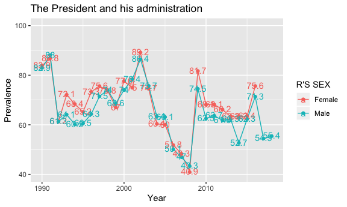

    ## Warning in if (!is.na(y_range)) {: the condition has length > 1 and only the
    ## first element will be used


    ## Warning in if (!is.na(y_range)) {: the condition has length > 1 and only the
    ## first element will be used

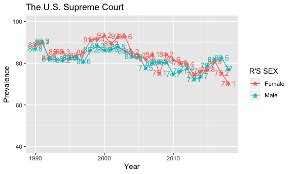

    ## Warning in if (!is.na(y_range)) {: the condition has length > 1 and only the
    ## first element will be used

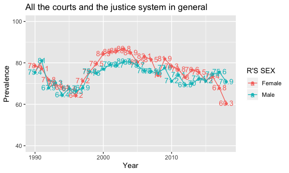

    ## Warning in if (!is.na(y_range)) {: the condition has length > 1 and only the
    ## first element will be used

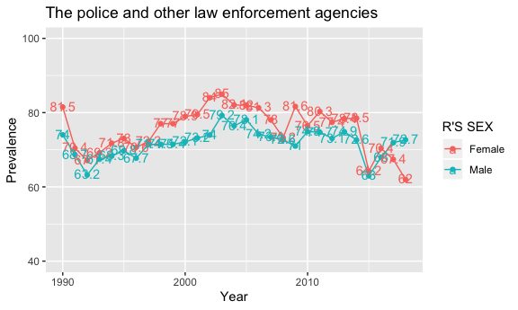

    ## Warning in if (!is.na(y_range)) {: the condition has length > 1 and only the
    ## first element will be used

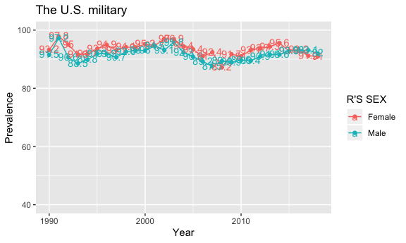

    ## Warning in if (!is.na(y_range)) {: the condition has length > 1 and only the
    ## first element will be used

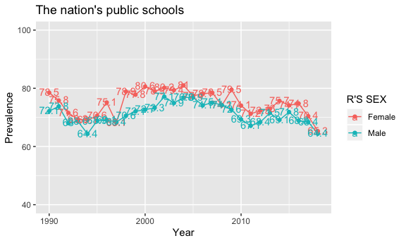

    ## Warning in if (!is.na(y_range)) {: the condition has length > 1 and only the
    ## first element will be used

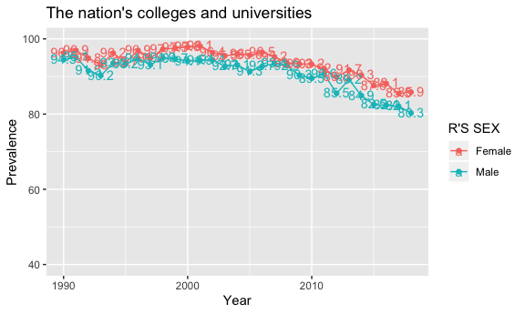

    ## Warning in if (!is.na(y_range)) {: the condition has length > 1 and only the
    ## first element will be used

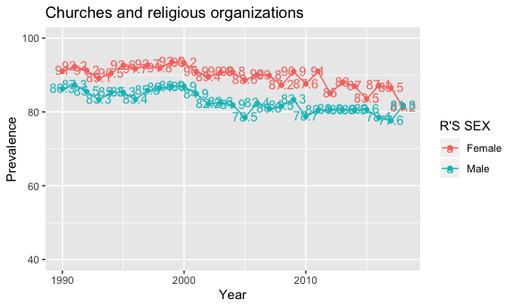

    ## Warning in if (!is.na(y_range)) {: the condition has length > 1 and only the
    ## first element will be used

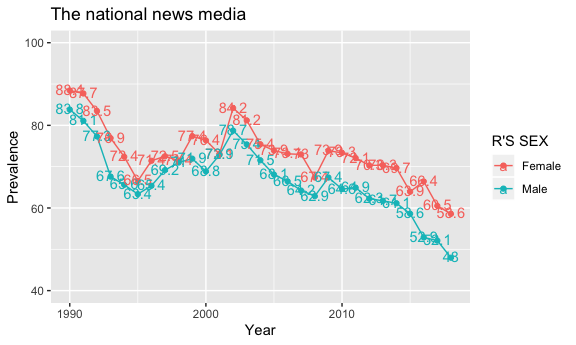

    ## Warning in if (!is.na(y_range)) {: the condition has length > 1 and only the
    ## first element will be used

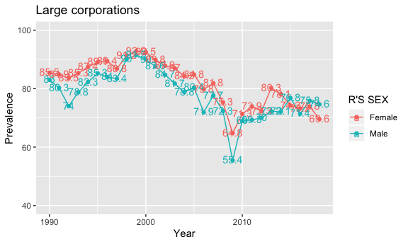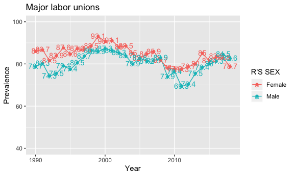

Next steps:

  - Graph by demographic or other factors
  - Output multiple plots
  - Tile the plots
  - Adjust axes
  - Dichotomize differently?
