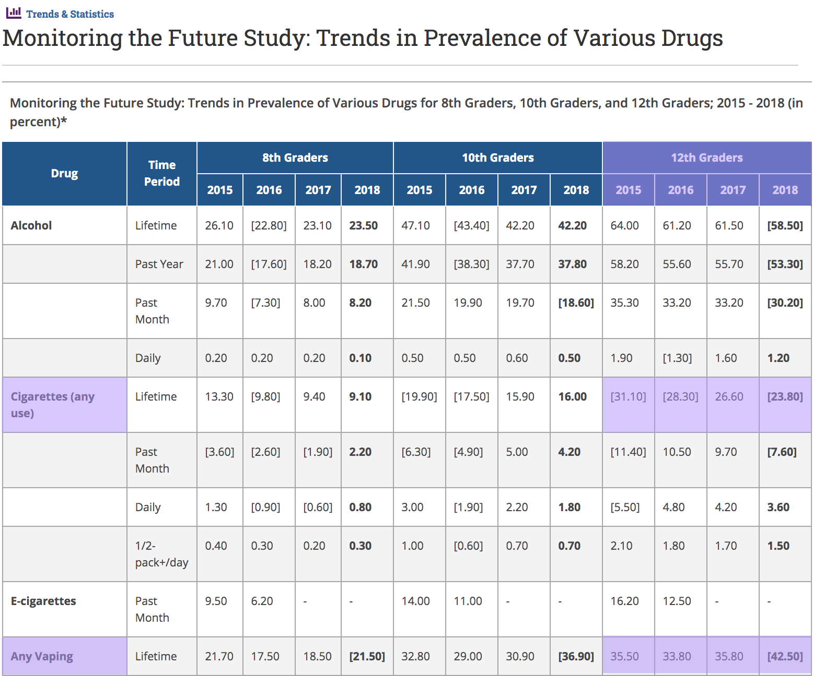

My goal here is to combine code from different places for a proof-of-concept: to see whether I can quickly go from raw MTF data to a visualisation of a time trend for a given variable. To start off with, a couple limitations will be:

* Only using variables included in grade 12, file 1
* Only looking at one variable over time, with everyone's responses
* I'm not doing any checks, tests, or validation of anything (so don't rely on any of the information from this!)

```{r setup, include=FALSE}
knitr::opts_chunk$set(echo = TRUE)
library(tidyverse)
require(haven)
require(stringr)
```

# Code

This chunk includes:

1. A helper function which tries to standardize varable labels from MTF datasets across years.
2. A function that creates a table that maps standardized labels to variable names to years, so we can use it to look up something like "was `age` asked in 2014? what was the column called?"

*Note: I couldn't get it to work with `source()` in the files, but ideally I'd like these split up?*
```{r code=xfun::read_utf8('../tools/mapping-variable-names-to-labels/create-mapping.R')}
```

This function takes a mapping like we created above, and gets all of the MTF data that the user wants, based on the years and variables that they specify.
```{r code=xfun::read_utf8('../tools/creating-datasets/get-specific-data-by-years.R')}
```

This function takes a database, variable inside that database, and an encoding, and makes a plot of prevalence over time.
```{r code=xfun::read_utf8('../tools/visualization/plot-prevalence-over-time.R')}
```

# Results

Putting it all together (examples of some standard substance use questions, from file 1):
```{r, message = FALSE}
grade12_file1_mapping = tibble()

for (year in 2015:2018) {
  grade12_file1_mapping = rbind(grade12_file1_mapping,
                                create_mapping(path = "~/Documents/Code/MTF/MTFData/12th_grade/",
                                               year = year,
                                               file_number = 1
                                )
  )
}

smallDB = get_specific_data_by_years(path = "~/Documents/Code/MTF/MTFData/12th_grade/",
                                    file_number = 1,
                                    years = 2015:2018,
                                    mapping = grade12_file1_mapping,
                                    variables_to_include = c("R'S ID-SERIAL #",
                                                             "SAMPLING WEIGHT",
                                                             "R'S SEX",
                                                             "EVER VAPE",
                                                             "EVR SMK CIG,REGL",
                                                             "#X E-CIG/30DAY"))

plot_prevalence_over_time(dataset = smallDB,
                          variable = "EVER VAPE",
                          yes_codes = c("1"),
                          no_codes = c("0"),
                          title = "Ever vaped - 12th grade")

plot_prevalence_over_time(dataset = smallDB,
                          variable =  "EVR SMK CIG,REGL",
                          yes_codes = c("2", "3", "4", "5"),
                          no_codes = c("1"),
                          title = "Ever smoked cigarettes - 12th grade")
```

Here are the numbers from the [NIH website](https://www.drugabuse.gov/drug-topics/trends-statistics/monitoring-future/monitoring-future-study-trends-in-prevalence-various-drugs), just to verify we're getting similar ones!



Next step: getting longer time trends for some of the social/gender questions I'm interested in:
```{r}
#what needs to change?
#some functions presume file 1
#need to figure out regex for new files

grade12_file4_mapping = tibble()

for (year in 1990:2018) {
  grade12_file4_mapping = rbind(grade12_file4_mapping,
                                create_mapping(path = "~/Documents/Code/MTF/MTFData/12th_grade/",
                                               year = year,
                                               file_number = 4
                                )
  )
}

smallDB = get_specific_data_by_years(path = "~/Documents/Code/MTF/MTFData/12th_grade/",
                                     file_number = 4,
                                     years = 1990:2018,
                                     mapping = grade12_file4_mapping,
                                     variables_to_include = c("R'S ID-SERIAL #",
                                                             "SAMPLING WEIGHT",
                                                             "R'S SEX",
                                                             "MN=ACHV/WMN=HOME",
                                                             "WMN SHD =JOB OPP",
                                                             "GOVT DEAL ENV PR"))

knitr::kable(head(smallDB))

plot_prevalence_over_time(dataset = smallDB,
                          variable = "MN=ACHV/WMN=HOME",
                          yes_codes = c("4", "5"),
                          no_codes = c("1", "2", "3"),
                          title = "It is usually better for everyone involved if the man is the achiever outside the home and the woman takes care of the home and family - 12th grade, 'Mostly Agree' + 'Agree'")

plot_prevalence_over_time(dataset = smallDB,
                          variable =  "WMN SHD =JOB OPP",
                          yes_codes = c("4", "5"),
                          no_codes = c("1", "2", "3"),
                          title = "A woman should have exactly the same job opportunities as a man - 12th grade, 'Mostly Agree' + 'Agree'")

plot_prevalence_over_time(dataset = smallDB,
                          variable =  "GOVT DEAL ENV PR",
                          yes_codes = c("4", "5"),
                          no_codes = c("1", "2", "3"),
                          title = "Government should take steps to deal with our environmental problems, even if it means that most of us pay higher prices or taxes - 12th grade, 'Mostly Agree' + 'Agree'")
```

