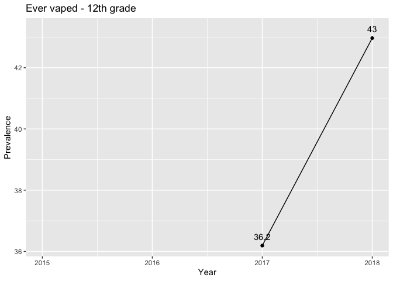
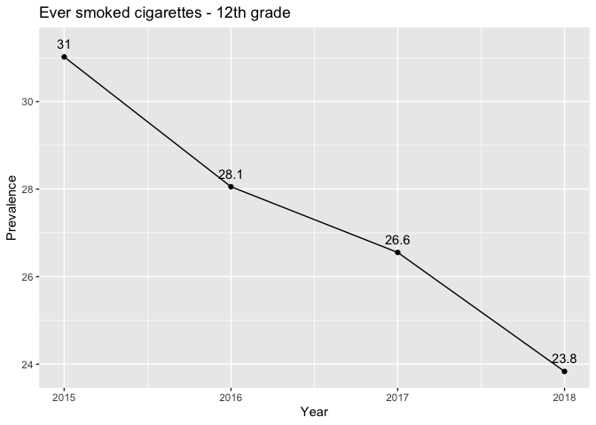

Variable name mapping -\> visualizing time trends
================

My goal here is to combine code from different places for a
proof-of-concept: to see whether I can quickly go from raw MTF data to a
visualisation of a time trend for a given variable. To start off with, a
couple limitations will be:

  - Only using variables included in grade 12, file 1
  - Only looking at one variable over time, with everyone’s responses
  - I’m not doing any checks, tests, or validation of anything (so don’t
    rely on any of the information from this\!)

# Code

This chunk includes:

1.  A helper function which tries to standardize varable labels from MTF
    datasets across years.
2.  A function that creates a table that maps standardized labels to
    variable names to years, so we can use it to look up something like
    “was `age` asked in 2014? what was the column called?”

*Note: I couldn’t get it to work with `source()` in the files, but
ideally I’d like these split
up?*

``` r
#source("tools/mapping-variable-names-to-labels/create-standard-helpful-name.R")

create_standard_helpful_name = function(unedited_name = unedited_name) {
  # everything to uppercase
  helpful_name = str_to_upper(unedited_name)
  
  # take away alphanumerics at the beginning if they fit the pattern ###C##CC
  helpful_name = str_remove(helpful_name, "^[0-9]{3}C[0-9]{2}[A-Z]{2}")
  
  # remove anything before a delineation character like : | ; ! and (R)
  #    (might be blank before special char, from removal in line above)
  helpful_name = str_remove(helpful_name, "^.*[:|\\||;|!]\\s*")
  helpful_name = str_remove(helpful_name, "[A-z0-9]+\\(R\\)")
  
  # for the specific format that goes `BYyy ALPHANUM varname` strip to just varname
  helpful_name = str_remove(helpful_name, "^BY[0-9]{2} [A-z0-9]+ ")
  
  # for the one weird case in 1997 where `= "caseid"` was left in the name
  helpful_name = str_remove(helpful_name, '\\= \\"')
  helpful_name = str_remove(helpful_name, '\\"$')
  
  # 'H'/ "H"/ and H/ are used interchangeably, so convert everything to no quotes
  helpful_name = str_replace(helpful_name, "\\'H\\'\\/", "H/")
  helpful_name = str_replace(helpful_name, '\\"H\\"\\/', "H/")
  
  # strip extra spaces from around equal signs
  helpful_name = str_replace_all(helpful_name, " = ", "=")
  
  # standardize the way that /LAST 30 DAYS and /LAST 12 MO is written wrt. spaces and cutting off DAY
  helpful_name = str_replace(helpful_name, "\\/LAST ", "\\/LAST")
  helpful_name = str_replace(helpful_name, "30 DA", "30DA")
  helpful_name = str_replace(helpful_name, "30D[A]?$", "30DAY")
  helpful_name = str_replace(helpful_name, "12 MO", "12MO")
  helpful_name = str_replace(helpful_name, "12M[O]?", "12MO")
  helpful_name = str_replace(helpful_name, "LIFETIM[E]?", "LIFETIME")
  helpful_name = str_replace(helpful_name, "SED\\/BARB\\/30DAY", "SED\\/BARB\\/LAST30DAY")
  helpful_name = str_replace(helpful_name, "SED\\/BARB\\/12MO", "SED\\/BARB\\/LAST12MO")
  helpful_name = str_replace(helpful_name, "SED\\/BARB\\/LIFE(TIME)?", "SED\\/BARB\\/LIFETIME")
  
  # standardize the way that MSA/NON-MSA = 0 etc. is written
  helpful_name = str_replace_all(helpful_name, "SMSA", "MSA")
  helpful_name = str_replace(helpful_name, "MSA(=1)?\\/NON[ |\\-]MSA", "MSA/NON-MSA")
  helpful_name = str_replace(helpful_name, "072 LARGE MSA=1/NOT=0", "LARGE MSA=1/NOT=0")
  
  # standardize the way that a bunch more random things are written
  helpful_name = str_replace(helpful_name, "R XPCTS BE? OFFCR", "R XPCTS BE OFFCR")
  helpful_name = str_replace(helpful_name, "R'S HSHLD MOTHE?R", "R'S HSHLD MOTHER")
  helpful_name = str_replace(helpful_name, "R'S HSHLD FATHE?R", "R'S HSHLD FATHER")
  helpful_name = str_replace(helpful_name, "R[ |']ATTND", "R'ATTND")
  helpful_name = str_replace(helpful_name, "R[ |']POL", "R'POL")
  helpful_name = str_replace(helpful_name, "RLGN IMP R'?S LF", "RLGN IMP R'S LF")
  helpful_name = str_replace(helpful_name, "YEAR OF ADMIN.*", "YEAR OF ADMIN")
  
  helpful_name = str_replace(helpful_name, "R'S HSHLD SPOUSE?", "R'S HSHLD SPOUSE")
  helpful_name = str_replace(helpful_name, "R'S HSHLD RELTVS?", "R'S HSHLD RELTVS")
  helpful_name = str_replace(helpful_name, "R'S HSHLD NONRLT?", "R'S HSHLD NONRLT")
  helpful_name = str_replace(helpful_name, "R'S HSHLD GRPR[T|N][T|N]?", "R'S HSHLD GRPRNT")
  helpful_name = str_replace(helpful_name, "R'S HSHLD CHLDRN?", "R'S HSHLD CHLDRN")
  helpful_name = str_replace(helpful_name, "SCH REG-4 CAT", "SCHL RGN-4 CAT")
  
  # if something starts with RS, convert to R'S.
  helpful_name = str_replace(helpful_name, "^R[S|s]", "R'S")
  
  # for two years, respondent ID was listed as ARCHIVE ID. Other years there was an extra space. Standardize
  helpful_name = str_replace(helpful_name, "ARCHIVE ID|R'S  ID-SERIAL #", "R'S ID-SERIAL #")
  
  # at some point, sampling weight switched to archive weight 
  helpful_name = str_replace(helpful_name, "ARCHIVE WEIGHT", "SAMPLING WEIGHT")
  
  # trim whitespace off of either end
  helpful_name = str_trim(helpful_name)
  
  helpful_name
}

create_mapping = function(path = path,
                          year = year,
                          file_number = file_number
) {
  
  mapping = tibble(
    helpful_name = character(),
    unedited_name = character(),
    year = numeric(),
    variable_name = character(),
    file_number = numeric()
  )
  
  file_name = str_c(path, "y", year, "_", file_number,".sas7bdat")
  this_year_data = read_sas(data_file = file_name)
  
  for (col in 1:ncol(this_year_data)) {
    unedited_name = attr(this_year_data[[col]], "label")
    helpful_name = create_standard_helpful_name(unedited_name)
    
    mapping = add_row(mapping,
                      helpful_name = helpful_name,
                      unedited_name = unedited_name,
                      year = year,
                      variable_name = colnames(this_year_data)[col],
                      file_number = file_number
    )
  }
  mapping
}
```

This function takes a mapping like we created above, and gets all of the
MTF data that the user wants, based on the years and variables that they
specify.

``` r
library(tidyverse)
require(haven) # lets us read SAS files
require(stringr) # lets us subset a string using negative numbers

get_specific_data_by_years = function(path = path,
                                      years = years,
                                      mapping = mapping,
                                      variables_to_include = variables_to_include) {
  all_years = tibble()
  
  for (this_year in years) {
    # this depends on what file the questions are in. For now, assume everything is in file 1.
    file_name = str_c(path, "y", this_year, "_1.sas7bdat")
    
    relevant_variables_and_years = filter(grade12_file1_mapping,
                                          year == this_year & helpful_name %in% variables_to_include)
    original_variable_names = relevant_variables_and_years$variable_name
    rename_vector = original_variable_names
    names(rename_vector) = relevant_variables_and_years$helpful_name
    
    excluded = setdiff(variables_to_include, relevant_variables_and_years$helpful_name)
    
    # What's happening in these piped functions below:
    # 1. Select all of the variables from our mapping table that existed for this year of the survey
    # 2. Add in (mutate) columns for year and grade
    # 3. rename varables from MTF names to helpful_names
    this_year_data = read_sas(data_file = file_name) %>% 
      select(.,
             one_of(original_variable_names)
      ) %>%
      mutate(.,
             year = this_year,
             grade = 12
      ) %>%
      rename(.,
             !!rename_vector)
    
    # 4. add in any variables that were excluded that year as -8 (but was specfied by user to variables_to_include),
    # ...so that the datasets can be stacked later
    # QUESTON: is there a dplyr way to do this, not in a for loop?
    for (excluded_var in excluded) {
      this_year_data = mutate(this_year_data, !!excluded_var := -8)
    }
    
    # QUESTION: is there a better way to combine data frames vertically, by comlumn name??
    # need to sort alphabetically before binding rows
    this_year_data = this_year_data %>% select(sort(tidyselect::peek_vars()))
    
    # QUESTON: will I have trouble with factors?
    all_years = bind_rows(all_years, this_year_data)
  }
  
  all_years
}
```

This function takes a database, variable inside that database, and an
encoding, and makes a plot of prevalence over time.

``` r
library(tidyverse)

plot_prevalence_over_time = function(dataset = dataset,
                                     variable = variable,
                                     yes_codes = yes_codes,
                                     no_codes = no_codes,
                                     title = title) {
  
  # get (weighted) counts by year for our variable of interest, split up by the codes designated in the input
  counts = dataset %>% 
    mutate(.,
           matches_criteria = 
             case_when(!!sym(variable) %in% yes_codes ~ "yes",
                       !!sym(variable) %in% no_codes ~ "no",
                       TRUE ~ "leave out")
    ) %>% 
    group_by(., year) %>% 
    count(., matches_criteria, wt = `SAMPLING WEIGHT`)
  
  # get the "percent yes" for each year/grade group.
  # the pivot_wider gets us a DB where each row represents one year, and has columns for yes, no, leave out, and then our calculated percent_yes 
  percent_yes_db = counts %>%
    pivot_wider(., names_from = matches_criteria, values_from = n) %>%
    mutate(.,
           percent_yes = (yes / (yes + no))*100
    ) %>%
    select(., year, percent_yes) %>%
    ungroup(.)
  
  plot = ggplot(percent_yes_db,
                aes(x = year, y = percent_yes)
  ) +
    geom_line() +
    geom_point() +
    labs(
      title = title,
      x = "Year",
      y = "Prevalence"
    ) +
    geom_text(label = round(percent_yes_db$percent_yes, 1), nudge_x = 0, nudge_y = .3)
  
  plot
}
```

# Results

Putting it all together (examples of some standard substance use
questions, from file 1):

``` r
grade12_file1_mapping = tibble()

for (year in 2015:2018) {
  grade12_file1_mapping = rbind(grade12_file1_mapping,
                                create_mapping(path = "~/Documents/Code/MTF/MTFData/12th_grade/",
                                               year = year,
                                               file_number = 1
                                )
  )
}

smallDB = get_specific_data_by_years(path = "~/Documents/Code/MTF/MTFData/12th_grade/",
                                    years = 2015:2018,
                                    mapping = grade12_file1_mapping,
                                    variables_to_include = c("R'S ID-SERIAL #",
                                                             "SAMPLING WEIGHT",
                                                             "R'S SEX",
                                                             "EVER VAPE",
                                                             "EVR SMK CIG,REGL",
                                                             "#X E-CIG/30DAY"))

plot_prevalence_over_time(dataset = smallDB,
                          variable = "EVER VAPE",
                          yes_codes = c("1"),
                          no_codes = c("0"),
                          title = "Ever vaped - 12th grade")
```

    ## Warning: Removed 2 rows containing missing values (geom_path).

    ## Warning: Removed 2 rows containing missing values (geom_point).

    ## Warning: Removed 2 rows containing missing values (geom_text).

<!-- -->

``` r
plot_prevalence_over_time(dataset = smallDB,
                          variable =  "EVR SMK CIG,REGL",
                          yes_codes = c("2", "3", "4", "5"),
                          no_codes = c("1"),
                          title = "Ever smoked cigarettes - 12th grade")
```

<!-- -->

Here are the numbers from the [NIH
website](https://www.drugabuse.gov/drug-topics/trends-statistics/monitoring-future/monitoring-future-study-trends-in-prevalence-various-drugs),
just to verify we’re getting similar ones\!


Next step: getting longer time trends for some of the social/gender
questions I’m interested in:

``` r
#what needs to change?
#some functions presume file 1
#need to figure out regex for new files

grade12_file3_mapping = tibble()

for (year in 1990:2018) {
  grade12_file3_mapping = rbind(grade12_file3_mapping,
                                create_mapping(path = "~/Documents/Code/MTF/MTFData/12th_grade/",
                                               year = year,
                                               file_number = 3
                                )
  )
}

smallDB = get_specific_data_by_years(path = "~/Documents/Code/MTF/MTFData/12th_grade/",
                                    years = 1990:2018,
                                    mapping = grade12_file3_mapping,
                                    variables_to_include = c("R'S ID-SERIAL #",
                                                             "SAMPLING WEIGHT",
                                                             "R'S SEX",
                                                             "??"))

plot_prevalence_over_time(dataset = smallDB,
                          variable = "??",
                          yes_codes = c("??"),
                          no_codes = c("??"),
                          title = "??")

plot_prevalence_over_time(dataset = smallDB,
                          variable =  "??",
                          yes_codes = c("??"),
                          no_codes = c("??"),
                          title = "??")
```
